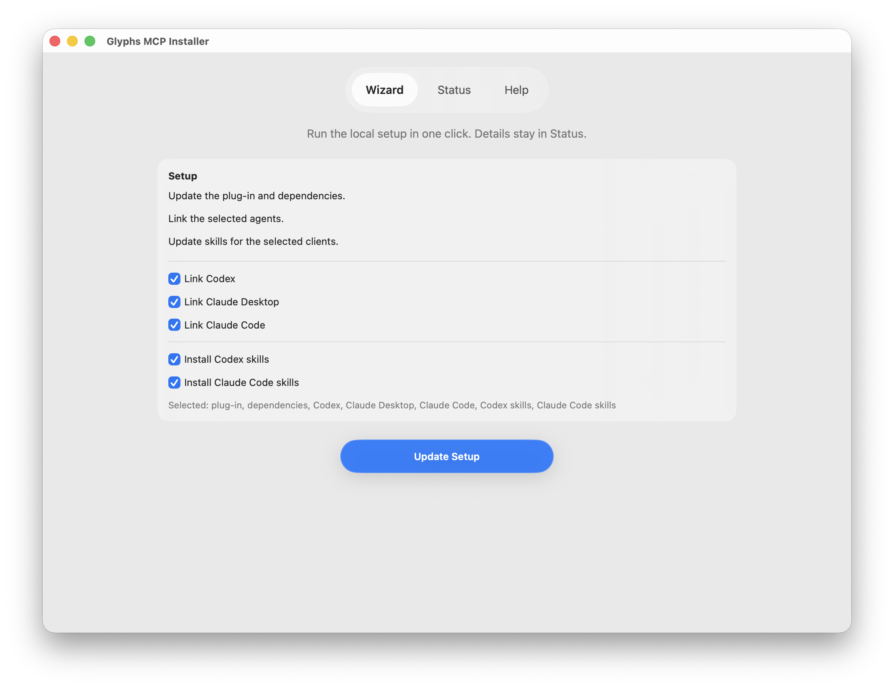

# Glyphs MCP
Site: https://ap.cx/gmcp

A Model Context Protocol server for [Glyphs](https://glyphsapp.com) that exposes font‑specific tools to AI/LLM agents.

---

## macOS Installer app (recommended)

The Installer app is the simplest way to install `Glyphs MCP.glyphsPlugin`, install Python dependencies, and link Glyphs MCP into:

- Codex App
- Codex CLI (terminal tools or in VS Code)
- Claude App
- Claude CLI (terminal tools or in VS Code)



- Download (DMG): https://github.com/thierryc/Glyphs-mcp/releases/latest/download/GlyphsMCPInstaller.dmg
- Download (ZIP): https://github.com/thierryc/Glyphs-mcp/releases/latest/download/GlyphsMCPInstaller.zip
- Latest release: https://github.com/thierryc/Glyphs-mcp/releases/latest

The installer can also install the bundled Glyphs MCP skills for Codex and Claude CLI.

Any MCP client compatible with the MCP protocol can use this server. For now, the automatic installer covers only the apps listed above. Because Glyphs MCP is a localhost MCP server, manual setup in other clients is usually just the endpoint URL:

```text
http://127.0.0.1:9680/mcp/
```

Terminal installer:

```bash
python3 install.py
```

Finder alternative on macOS: double-click `RunInstall.command` in the repo root. It launches the same installer. If Gatekeeper blocks it, right-click → Open once.

Scripted install example:

```bash
python3 install.py --non-interactive --python-mode glyphs --plugin-mode link --install-skills --skills-target codex --overwrite-plugin --overwrite-skills --skip-client-guidance
```

Minimum requirements:
- macOS 13.0+
- Glyphs 3
- Python 3.11–3.13 (recommended: python.org 3.12)

## Repo skills for Codex and Claude Code

This repo ships a small bundle of workflow skills in `skills/` for common Glyphs MCP tasks. The same source of truth is exposed to both clients:

- Codex reads them through `.agents/skills`
- Claude Code reads them through `.claude/skills`

The supported usage patterns are:

### Use repo-local skills

Use this when you are developing in this repository or want the clients to discover the skills directly from the repo checkout.

1. Open this repository in Codex or Claude Code so the repo-local bridges are visible.
2. Connect Glyphs MCP:

```bash
codex mcp add glyphs-mcp-server --url http://127.0.0.1:9680/mcp/
codex mcp list

claude mcp add --scope user --transport http glyphs-mcp http://127.0.0.1:9680/mcp/
claude mcp list
```

3. In Codex, trust the workspace so `.agents/skills` loads.
4. In Claude Code, reload or restart if `.claude/skills` does not appear immediately.
5. Start Glyphs, confirm the server is running in **Edit -> Glyphs MCP Server Status...**, and pick the narrowest useful tool profile first.
6. Invoke a specific skill when you want a guided workflow:

```text
Use $glyphs-mcp-connect to verify my Glyphs MCP setup, call list_open_fonts, and tell me which font_index to use next.
```

### Install skills globally

Use this when you want the bundled `glyphs-mcp-*` skills available without opening the repo.

1. Run the installer from the repo root, or use the signed macOS installer app:

```bash
python3 install.py
```

2. In the installer, enable **Install Glyphs MCP agent skills** for Codex and/or Claude Code.
3. The installer copies the bundled skills into:
   - `~/.codex/skills/`
   - `~/.claude/skills/`
4. Reload or restart Codex / Claude Code after the installer finishes.
5. Ask for the skill by name:

```text
Use the glyphs-mcp-connect skill to verify my Glyphs MCP setup, call list_open_fonts, and tell me which font_index to use next.
```

Advanced Codex-only alternative: you can install individual skills with Codex’s built-in `$skill-installer`, but that is not the primary Glyphs MCP workflow.

Current repo skills focus on:
- connection and health checks for the local Glyphs MCP server
- guarded kerning bumper reviews and applies
- guarded spacing reviews and applies
- outlines, components, anchors, and docs lookup workflows

For the website docs version, see the agent skills pages in the docs site.

## What Is an MCP Server?

A *Model Context Protocol* server is a lightweight process that:

1. **Registers tools** (JSON‑RPC methods) written in the host language (Python here).  
2. **Streams JSON output** back to the calling agent. 

---

## Command Set (MCP server v1.0.17)
This table describes the tool surface exposed by the MCP server shipped in this repo (FastMCP `version="1.0.17"`).

| Tool | Description |
|------|-------------|
| `list_open_fonts` | List all open fonts and basic metadata. |
| `get_font_glyphs` | Return glyph list and key attributes for a font. |
| `get_font_masters` | Detailed master information for a font. |
| `get_font_instances` | List instances and their interpolation data. |
| `get_glyph_details` | Full glyph data including layers, paths, components. |
| `get_font_kerning` | All kerning pairs for a given master. |
| `generate_kerning_tab` | Generate a kerning review proof tab (missing relevant pairs + outliers) and open it. |
| `review_kerning_bumper` | Review kerning collisions / near-misses and compute deterministic “bumper” suggestions (no mutation). |
| `apply_kerning_bumper` | Apply “bumper” suggestions as glyph–glyph kerning exceptions (supports `dry_run`; requires `confirm=true` to mutate). |
| `create_glyph` | Add a new glyph to the font. |
| `delete_glyph` | Remove a glyph from the font. |
| `update_glyph_properties` | Change unicode, category, export flags, etc. |
| `copy_glyph` | Duplicate outlines / components from one glyph to another. |
| `update_glyph_metrics` | Adjust width and side‑bearings. |
| `review_spacing` | Review spacing and suggest sidebearings/width (area-based; no mutation). |
| `apply_spacing` | Apply spacing suggestions (supports `dry_run`; requires `confirm=true` to mutate). |
| `set_spacing_params` | Set spacing parameters as font/master custom parameters (no auto-save). |
| `set_spacing_guides` | Add or clear glyph-level guides visualizing the spacing measurement band (no auto-save). |
| `measure_stem_ratio` | Measure a stem ratio `b` between two masters (ref/base) for compensated tuning (no mutation). |
| `review_compensated_tuning` | Compute compensated-tuned outlines for one glyph from a base master plus a different compatible reference master (returns `set_glyph_paths`-compatible JSON; no mutation). |
| `apply_compensated_tuning` | Apply the same two-master compensated scaling transform across glyphs (backs up layers; supports `dry_run`; requires `confirm=true` to mutate). |
| `get_glyph_components` | Inspect components used in a glyph. |
| `add_component_to_glyph` | Append a component to a glyph layer. |
| `add_anchor_to_glyph` | Add an anchor to a glyph layer. |
| `set_kerning_pair` | Set or remove a kerning value. |
| `get_selected_glyphs` | Info about glyphs currently selected in UI. |
| `get_selected_font_and_master` | Current font + master and selection snapshot. |
| `get_selected_nodes` | Detailed selected nodes with per‑master mapping for edits. |
| `add_corner_to_all_masters` | Add a `_corner.*` corner hint at selected nodes (and intersection handles) across all masters (requires `_corner_name`; optional `_alignment`: `left`/`right`/`center` or `0`/`1`/`2`). |
| `get_glyph_paths` | Export paths in a JSON format suitable for LLM editing. |
| `review_collinear_handles` | Review a single path for curve nodes that should be smooth based on handle collinearity (no mutation). |
| `apply_collinear_handles_smooth` | Apply `smooth=True` for collinear-handle curve nodes in a single path (supports `dry_run`; requires `confirm=true` to mutate). |
| `set_glyph_paths` | Replace glyph paths from JSON. |
| `ExportDesignspaceAndUFO` | Export designspace/UFO bundles with structured logs and errors. |
| `execute_code` | Execute arbitrary Python in the Glyphs context. |
| `execute_code_with_context` | Execute Python with injected helper objects. |
| `save_font` | Save the active font (optionally to a new path). |
| `docs_search` | Search bundled Glyphs SDK/ObjectWrapper docs by title/summary. |
| `docs_get` | Fetch a bundled docs page by id/path (supports paging via offset/max_chars). |
| `docs_enable_page_resources` | Register each documentation page as its own MCP resource (optional; can flood clients). |

For performance-sensitive scripts, you can opt into lower-overhead execution:
- `capture_output=false` to avoid capturing stdout/stderr (prints go to the Macro Panel).
- `return_last_expression=false` to skip evaluating the final line as an expression.
- `max_output_chars` / `max_error_chars` to cap returned output and avoid huge responses.
- `snippet_only=true` to return a ready-to-paste **Macro Panel** snippet instead of executing (useful when you want manual control).
- Prefer `execute_code_with_context` for glyph-scoped mutations so the script runs with explicit `font` / `glyph` / `layer` helpers.
- Large glyph edits should still use `glyph.beginUndo()/endUndo()` or `layer.beginChanges()/endChanges()` inside the script.
- Glyphs undo is glyph-scoped, so master/global edits are not guaranteed undoable.

Avoid calling `exit()` / `quit()` / `sys.exit()` in `execute_code*`; they won't exit Glyphs and can disrupt the call.

### Macro (Glyphs): mark collinear-handle joins as smooth

Paste into **Window → Macro Panel**. Set `APPLY = False` first to review, then flip to `True`.

```python
import math
from GlyphsApp import Glyphs

THRESHOLD_DEG = 3.0
MIN_HANDLE_LEN = 5.0
APPLY = False

def vec(a, b):
    return (b.x - a.x, b.y - a.y)

def length(v):
    return math.hypot(v[0], v[1])

def angle_deg(v1, v2):
    l1 = length(v1)
    l2 = length(v2)
    if l1 == 0 or l2 == 0:
        return None
    dot = v1[0]*v2[0] + v1[1]*v2[1]
    c = max(-1.0, min(1.0, dot/(l1*l2)))
    return math.degrees(math.acos(c))

font = Glyphs.font
tab = font.currentTab if font else None
layers = list(getattr(tab, "layers", []) or []) if tab else list(getattr(font, "selectedLayers", []) or [])

hits = 0
for layer in layers:
    gname = layer.parent.name if layer.parent else "?"
    for p_i, path in enumerate(getattr(layer, "paths", []) or []):
        nodes = list(path.nodes)
        ncount = len(nodes)
        closed = bool(getattr(path, "closed", True))
        for i, n in enumerate(nodes):
            if getattr(n, "type", None) != "curve":
                continue
            prev_i = (i - 1) % ncount if closed else (i - 1)
            next_i = (i + 1) % ncount if closed else (i + 1)
            if prev_i < 0 or next_i >= ncount:
                continue
            prev_n = nodes[prev_i]
            next_n = nodes[next_i]
            if getattr(prev_n, "type", None) != "offcurve":
                continue
            if getattr(next_n, "type", None) != "offcurve":
                continue

            v_in = vec(prev_n.position, n.position)
            v_out = vec(n.position, next_n.position)
            if min(length(v_in), length(v_out)) < MIN_HANDLE_LEN:
                continue
            ang = angle_deg(v_in, v_out)
            if ang is None or ang > THRESHOLD_DEG:
                continue
            if bool(getattr(n, "smooth", False)):
                continue

            print(f"{gname} path={p_i} node={i} angle={ang:.3f} -> smooth")
            hits += 1
            if APPLY:
                n.smooth = True

print(f"Done. Candidates={hits}. APPLY={APPLY}")
```

### ExportDesignspaceAndUFO

Kick off a headless export of UFO masters and designspace documents directly from the MCP server. The tool returns absolute paths to generated files along with the exporter log so clients can surface progress in real time. Debug lines are prefixed with `[ExportDesignspaceAndUFO DEBUG]` and include helpful context about axis mappings, temporary folders, and file moves.

Failures now yield rich diagnostics instead of a bare string. In addition to `error`, the payload includes `errorType`, a formatted `traceback`, and contextual details about the font and options that triggered the exception. Use these fields to surface actionable feedback or drive automated retries without guessing what went wrong.

---

## Install & Setup

The simplest setup is the macOS Installer app or the terminal installer:

```bash
python3 install.py
```

The installer installs the plug-in, installs Python dependencies, and links Glyphs MCP into:

- Codex App
- Codex CLI (terminal tools or in VS Code)
- Claude App
- Claude CLI (terminal tools or in VS Code)

Any MCP-compatible client can use this server. For now, the automatic installer covers only the apps above. Because this is a localhost MCP server, manual configuration in other clients is usually just the endpoint URL:

```text
http://127.0.0.1:9680/mcp/
```

For automation or reproducible dev setup, use non-interactive mode:

```bash
python3 install.py --non-interactive --python-mode glyphs --plugin-mode link --install-skills --skills-target codex --overwrite-plugin --overwrite-skills --skip-client-guidance
```

If you need a manual install instead, copy or symlink `src/glyphs-mcp/Glyphs MCP.glyphsPlugin` into `~/Library/Application Support/Glyphs 3/Plugins/`, then restart Glyphs.

After installation, Glyphs MCP adds two menu items:

- **Edit → Start Glyphs MCP Server**
- **Edit → Glyphs MCP Server Status…**

The server endpoint is `http://127.0.0.1:9680/mcp/`.

### Tool profiles (reduce tool/schema prompt bloat)

Many MCP clients include the tool list + schemas in their prompt context. As the tool surface grows, this can waste tokens.

Use the **Profile** dropdown in **Glyphs MCP Server Status…** to expose only the tools you need for a task. The selection is saved in `Glyphs.defaults` and takes effect the next time the server starts (restart Glyphs if it’s already running).

Tip: If your coding agent doesn't connect to Glyphs, start the MCP server first on a fresh Glyphs launch, then launch the coding agent afterwards.

Open the **Macro Panel** to access the console.

## Resources (Helpers)

Resources are optional helpers to improve tool usage (especially code generation), not the primary feature.

- Guide: `glyphs://glyphs-mcp/guide`
- Docs directory listing: `glyphs://glyphs-mcp/docs`
- Docs index: `glyphs://glyphs-mcp/docs/index.json`

The guide defines the runtime execution contract for LLM agents:
- Read context before mutating.
- Prefer dedicated tools, then `execute_code_with_context` / `execute_code` for multi-step workflows.
- Verify changes with a read-back pass and report changed/skipped counts.

By default, per-page doc resources are not registered to avoid flooding clients.
Preferred: use `docs_search` + `docs_get` (on-demand). If you really want per-page resources, call `docs_enable_page_resources` (or set `GLYPHS_MCP_REGISTER_DOC_PAGES=1`).

## Installer Notes

- If you are unsure, accept the defaults: Glyphs Python and Copy.
- Prefer python.org Python 3.12+ over Homebrew for fewer macOS compatibility issues.
- On Apple Silicon, avoid Rosetta-translated Python builds.
- No `sudo` is required.
- Verify the local endpoint with `curl -H 'Accept: application/json' http://127.0.0.1:9680/mcp/`.

After regenerating the ObjectWrapper documentation, refresh the bundled copy with:

```bash
python src/glyphs-mcp/scripts/copy_documentation.py
```

## Build Site Images (WebP)

Docs use a splash image at `/images/glyphs-app-mcp/glyphs-mcp.webp`.

- Requirements: Node 20+ and the `sharp` package (`npm i sharp`).
- Convert PNG assets from `content/images/glyphs-app-mcp` to WebP in `public/images/glyphs-app-mcp`:

```bash
node scripts/convert-images.mjs
```

The script ensures `glyphs-mcp.webp` (the hero image for the doc) is generated, then converts the rest.

---

## Build Release ZIP (Clean)

To package the plug‑in for distribution without accidentally shipping local artifacts (`__pycache__`, `.pyc`, `.venv`, `__MACOSX`, etc.), use:

```bash
./scripts/build_release_zip.sh
```

Optionally override the version label used in the filename:

```bash
./scripts/build_release_zip.sh --version 1.0.0
```

The ZIP is written to `dist/` (ignored by git).

## Release

This repo ships two plugin bundle locations:

- Canonical source bundle: `src/glyphs-mcp/Glyphs MCP.glyphsPlugin`
- Glyphs Plugin Manager bundle (repo‑relative `path=` target): `plugin-manager/Glyphs MCP.glyphsPlugin`

Release flow (copy/paste):

```bash
# Optional: do the release on a branch
git switch -c lit/release-X.Y.Z

# 1) Bump the plugin/server version everywhere it needs to be
python3 scripts/bump_version.py X.Y.Z

# 2) Build the Plugin Manager bundle from tracked files (no __pycache__, .pyc, etc.)
# This creates a self-contained Plugin Manager bundle (includes vendored deps).
./scripts/build_plugin_manager_bundle.sh --vendor
# If you already have deps installed into Glyphs' Scripts/site-packages and want an offline build:
# ./scripts/build_plugin_manager_bundle.sh --vendor-from-installed --allow-missing-targets

# 3) Run tests
python3 -m unittest discover -s src/glyphs-mcp/tests

# 4) Commit release artifacts
git add README.md
git add "src/glyphs-mcp/Glyphs MCP.glyphsPlugin/Contents/Info.plist"
git add "plugin-manager/Glyphs MCP.glyphsPlugin"
git commit -m "Release X.Y.Z"

# 5) Build a clean ZIP for distribution
./scripts/build_release_zip.sh

# 6) Tag + push
git tag "vX.Y.Z"
git push origin HEAD --tags
```

## Glyphs Plugin Manager / glyphs-packages

In `glyphs-packages` (`glyphs3/packages.plist`), the plug‑in entry uses `path=` to point at a folder inside this repo.

For this repo, use:

```plist
url = "https://github.com/thierryc/Glyphs-mcp";
path = "plugin-manager/Glyphs MCP.glyphsPlugin";
dependencies = ();
```

The Plugin Manager bundle generated by `./scripts/build_plugin_manager_bundle.sh --vendor` vendors its Python dependencies inside the plug‑in, so no additional `glyphs-packages` modules are required.

## Contributing
PRs and feedback are welcome.

### Contributors
- Thierry Charbonnel (@thierryc) — Author
- Florian Pircher (@florianpircher)
- Georg Seifert (@schriftgestalt)
- Jeremy Tribby (@jpt)

---

 
