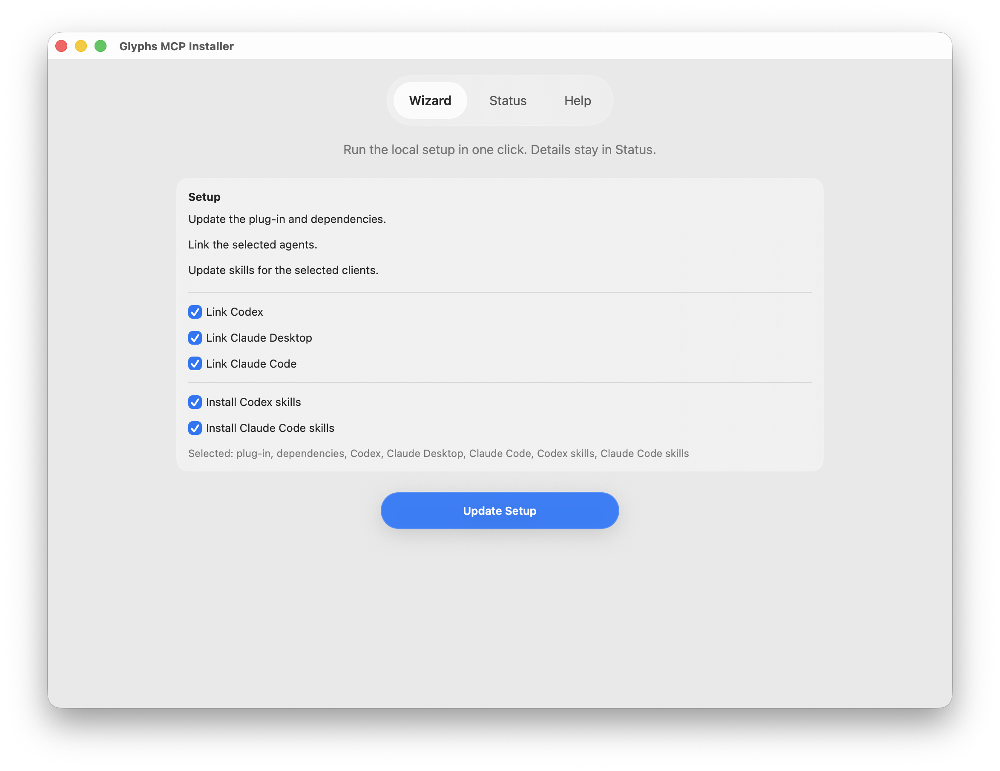

# Glyphs MCP

> [!IMPORTANT]
> **Glyphs 3 and Glyphs 4:** the `main` branch supports both major versions. The macOS installer detects each installed version and can target either or both. The terminal installer defaults to Glyphs 4; pass `--glyphs-version 3` for Glyphs 3.

Site: https://ap.cx/gmcp

A Model Context Protocol server for [Glyphs](https://glyphsapp.com) that exposes font‑specific tools to AI/LLM agents.

---

## What's new in 1.7.0

**Cleanroom cubic-curve engineering and native candidate review.**

- Add an independent, pure-Python cubic Bezier engine with no Glyphs UI,
  native binary, model, network, or new dependency requirement.
- Review Tunni intersections, handle ratios, imbalance, and conservative
  balance proposals for explicit glyph/master/path targets.
- Apply Tunni balancing only to explicit segment end-node indices after a dry
  run, with same-transaction recomputation, required main-thread change
  batching, actual-coordinate read-back, rollback, and no automatic save.
- Keep continuous Tunni mathematics as `idealProposed`, then select an
  authoritative font-grid candidate from a bounded deterministic search.
- Preview Tunni, collinear smoothing, italic-first-pass, and compensated-tuning
  candidates directly in Edit View through **View > Show Glyphs MCP Candidate**.
  The Reporter keeps the live outline unobscured and adds only a warm-yellow
  source/candidate symmetric difference; stale differences turn coral red.
  Materialize a full native layer only when manual editing is wanted, then
  re-review and promote the exact token-bound state through operation-approved
  fields.
- Report sampled signed curvature, inflections, degenerate tangents, exact
  maximum/median spike semantics, and smooth-join discontinuities as
  measurements and warnings rather than an artistic pass/fail verdict.
- Inspect a bounded signed curvature comb directly in Glyphs Edit View through
  **View > Show Glyphs MCP Curvature**. The native Reporter draws live teeth
  plus a connected envelope at `0.65` alpha, places curvature magnitude along
  the path right normal so correctly wound counters draw inward, and starts at
  51 samples per cubic with a `0.010` scale and `0.12em` normal clamp. It reports
  last-draw/clamp/cap/component state over MCP, and replaces PNG curvature as
  the recommended workflow.
- Support the same schemas and safety boundary in Glyphs 3.5 and Glyphs 4 while
  carrying forward 1.6.0's verified update staging and spacing safeguards.

[Read the full 1.7.0 changelog →](CHANGELOG.md) ·
[Cleanroom geometry record](content/contributor/curve-geometry-cleanroom.mdx) ·
[Experimental italic guide](content/italic-first-pass.md) ·
[Broad-Latin benchmark](content/contributor/italic-balanced-broad-latin-benchmark.md) ·
[Full-resolution three-family sheet](content/contributor/images/italic-balanced-three-family-story.png)

## macOS Installer app (recommended)

The signed and notarized Installer app is the supported end-user path. It
installs the already signed `Glyphs MCP.glyphsPlugin` without modifying its
signature, installs Python dependencies, and links Glyphs MCP into:

- Codex App
- Codex CLI (terminal tools or in VS Code)
- Claude App
- Claude CLI (terminal tools or in VS Code)

The macOS app detects Glyphs 3 and Glyphs 4 independently. If both are installed, both are selected by default; you can install or update either version alone by clearing the other checkbox. Each version keeps its own plug-in, Python, and Application Support status.



- Download (DMG): https://github.com/thierryc/Glyphs-mcp/releases/latest/download/GlyphsMCPInstaller.dmg
- Download (ZIP): https://github.com/thierryc/Glyphs-mcp/releases/latest/download/GlyphsMCPInstaller.zip
- Latest release: https://github.com/thierryc/Glyphs-mcp/releases/latest

The installer can also install the bundled Glyphs MCP skills for Codex and Claude CLI.

Any MCP client compatible with the MCP protocol can use this server. For now, the automatic installer covers only the apps listed above. Because Glyphs MCP is a localhost MCP server, manual setup in other clients is usually just the endpoint URL:

```text
http://127.0.0.1:9680/mcp/
```

Terminal installer:

```bash
python3 install.py
```

In its default **Copy** mode, the terminal installer downloads the installer
ZIP for the exact version in the checkout, verifies its published SHA-256,
Developer ID signature, Team ID, notarization ticket, Gatekeeper acceptance,
and embedded plug-in signature and stapled ticket, then installs that verified
payload transactionally. The matching GitHub release must already exist and
the machine must be online.

The terminal installer targets Glyphs 4 by default. To install into Glyphs 3 explicitly, pass `--glyphs-version 3`. The macOS app instead detects and offers every installed Glyphs 3/4 target.

Finder alternative on macOS: double-click `RunInstall.command` in the repo root. It launches the same terminal installer.

To uninstall, open the app’s **Status** page and choose **Uninstall…**. The review sheet lists the exact Glyphs 3/4 plug-ins, managed skills, and matching client entries before asking for confirmation. From Terminal, preview both versions first and then run the interactive uninstall:

```bash
python3 install.py --uninstall --glyphs-version both --dry-run
python3 install.py --uninstall --glyphs-version both
```

The uninstaller intentionally preserves shared Python packages, Glyphs preferences, plug-in settings, font annotations, documents, repositories, and shared parent folders.

Scripted signed-release install example:

```bash
python3 install.py --non-interactive --python-mode glyphs --plugin-mode copy --install-skills --skills-target codex --overwrite-plugin --overwrite-skills --skip-client-guidance
```

`--plugin-mode link` is only for development from a trusted checkout. It links
mutable source code into Glyphs and provides no release-signature or
notarization guarantee.

Minimum requirements:
- macOS 13.0+
- Glyphs 3 or Glyphs 4 beta
- Python 3.11–3.14 (recommended: python.org 3.14)

Glyphs 3 backward compatibility is maintained for the shared MCP server code where possible. The macOS app can target it directly; use `--glyphs-version 3` with the terminal installer.

## Optional agent plugins

Glyphs MCP 1.7.0 provides one shared plugin package for Codex/ChatGPT, Claude
Code, Cursor, and GitHub Copilot CLI. Every host gets its own native manifest,
but all four load the same nine skills and the same local MCP connection:

```text
http://127.0.0.1:9680/mcp/
```

Install the native Glyphs plug-in and start the server first. Then choose the
agent-plugin path only if it suits your client:

| Host | Optional plugin setup |
| --- | --- |
| Codex/ChatGPT | `codex plugin marketplace add thierryc/Glyphs-mcp` then `codex plugin add glyphs-mcp@glyphs-mcp` |
| Claude Code | `claude plugin marketplace add thierryc/Glyphs-mcp` then `claude plugin install glyphs-mcp@glyphs-mcp` |
| Cursor | Add the repository catalog with `cursor-agent plugin marketplace add https://github.com/thierryc/Glyphs-mcp` and finish in `/plugin`, or link/copy `plugins/glyphs-mcp` into `~/.cursor/plugins/local/glyphs-mcp`. |
| GitHub Copilot CLI | `copilot plugin marketplace add thierryc/Glyphs-mcp` then `copilot plugin install glyphs-mcp@glyphs-mcp` |

GitHub Copilot CLI can alternatively install the package directly:

```bash
copilot plugin install thierryc/Glyphs-mcp:plugins/glyphs-mcp
```

Plugins are an option, not a requirement. Repo-local skills, global standalone
skills, and manual MCP configuration remain supported. The macOS and terminal
installers do not install, update, or remove these agent plugins; each host owns
that lifecycle. The repository also does not enable GitHub Copilot plugins
through `.github/copilot/settings.json`.

All host manifests use version `1.7.0`. Skills inherit that package version,
while the running MCP server reports the matching native Glyphs MCP version.
See [Use agent skills and optional plugins](content/getting-started/use-agent-skills.mdx)
for install, update, removal, fallback, and host-specific invocation details.
The [Codex and ChatGPT plugin UI](content/getting-started/codex-chatgpt-plugin-ui.mdx)
page documents the richer embedded feedback panel available on compatible
OpenAI hosts; Claude, Cursor, Copilot, and other MCP clients keep the same text
and structured-result fallbacks.

## Repo skills for Codex, Claude Code, Cursor, and GitHub Copilot

This repo ships nine workflow skills in `skills/` for common Glyphs MCP tasks.
The same source of truth is exposed through client-specific discovery paths:

- Codex, Cursor, and GitHub Copilot CLI read them through `.agents/skills`
- Claude Code reads them through `.claude/skills`

The supported usage patterns are:

### Use repo-local skills

Use this when you are developing in this repository or want the clients to discover the skills directly from the repo checkout.

1. Open this repository in Codex, Claude Code, Cursor, or GitHub Copilot CLI so the repo-local bridges are visible.
2. Connect Glyphs MCP:

```bash
codex mcp add glyphs-mcp-server --url http://127.0.0.1:9680/mcp/
codex mcp list

claude mcp add --scope user --transport http glyphs-mcp http://127.0.0.1:9680/mcp/
claude mcp list
```

3. In Codex, trust the workspace so `.agents/skills` loads.
4. In Claude Code, reload or restart if `.claude/skills` does not appear immediately.
5. In Cursor, use the repo's `.agents/skills` bridge and add the local endpoint
   to `.cursor/mcp.json`; use `.cursor/skills` only as an explicit fallback.
6. In GitHub Copilot CLI, use `.agents/skills` and add the endpoint manually
   with `copilot mcp add glyphs-mcp-server --url http://127.0.0.1:9680/mcp/ --type http`.
7. Start Glyphs, confirm the server is running in **Edit -> Glyphs MCP Server**, and keep the default `Edit` profile unless you only need read-only inspection.
8. Start with the general Glyphs launcher, or invoke a focused skill when you already know the workflow:

```text
Use $glyphs to inspect the current Glyphs context and help with my font task.
```

### Install skills globally

Use this when you want the bundled Glyphs MCP skills available without opening the repo.

1. Run the installer from the repo root, or use the signed macOS installer app:

```bash
python3 install.py
```

2. In the installer, enable **Install Glyphs MCP agent skills** for Codex and/or Claude Code.
3. The installer copies the bundled skills into:
   - `~/.codex/skills/`
   - `~/.claude/skills/`
4. Reload or restart Codex / Claude Code after the installer finishes.
5. Ask for the skill by name:

```text
Use the glyphs skill to inspect the current Glyphs context and help with my font task.
```

Advanced Codex-only alternative: you can install individual skills with Codex’s built-in `$skill-installer`, but that is not the primary Glyphs MCP workflow.

Current repo skills focus on:
- a general `$glyphs` launcher with connection and context checks
- documentation-grounded Glyphs Python script and plug-in development
- OpenType feature and stylistic-set inspection with Glyphs links
- stable Unicode and PUA assignments for icon and symbol fonts
- guarded kerning bumper reviews and applies
- guarded spacing reviews and applies
- outlines, components, anchors, and docs lookup workflows
- guarded roman-to-italic first-pass copy and slant workflows
- version, documentation, packaging, validation, signing, and publication gates

For exact per-client paths and a compatibility matrix, see
[Use skills](content/getting-started/use-agent-skills.mdx).

## What Is an MCP Server?

A *Model Context Protocol* server is a lightweight process that:

1. **Registers tools** (JSON‑RPC methods) written in the host language (Python here).  
2. **Streams JSON output** back to the calling agent. 

---

## Command Set (MCP server v1.7.0)
This table describes the tool surface exposed by the MCP server shipped in this repo (version `1.7.0`).

Glyph/layer inspection responses may include `showUrl`, `showHttpUrl`, and
`showMarkdown` fields. `showUrl` keeps the native `glyphsapp://show/` URL.
`showMarkdown` uses a local `http://127.0.0.1:9680/glyphs-show/` bridge URL so
LLM clients that block custom URL schemes can still render a clickable link; the
bridge redirects to Glyphs. Unsaved fonts return `showUrlUnavailableReason`
instead because Glyphs requires an absolute file path.

| Tool | Description |
|------|-------------|
| `get_server_info` | Return runtime health plus open-font summaries with source format and last-saved app versions. |
| `list_open_fonts` | List all open fonts, including `formatVersion` and `lastSavedAppVersion`. |
| `get_font_glyphs` | Return glyph list and key attributes for a font, including clickable Glyphs show links when available. |
| `get_font_masters` | Detailed master information for a font, including Metrics `italicAngle` and legacy custom-parameter `slantAngle`. |
| `get_font_instances` | List instances and their interpolation data. |
| `get_custom_parameters` | Read font/master custom parameters, including effective master-over-font values and duplicate records. |
| `set_custom_parameters` | Preview or confirm generic font/master custom-parameter sets and deletes; redraws but never auto-saves. |
| `get_glyph_details` | Full glyph data including layers, paths, components, and Glyphs show links. |
| `list_style_sets` | List stylistic-set features (`ss01`-`ss20`) with source/replacement glyphs and a group-level Glyphs show link for alternates. |
| `review_unicode_assignments` | Review whole-font Unicode mappings and optionally propose deterministic assignments in a caller-selected range. |
| `show_glyphs_status` | Show server, Glyphs, and open-font status in the embedded feedback panel. |
| `show_font_feedback` | Show bounded, read-only information for one open font. |
| `show_glyph_feedback` | Show metadata, dimensions, sidebearings, anchors, components, layers, and warnings without outline paths. |
| `show_opentype_features` | Show a read-only OpenType report with active/automatic state, warnings, line counts, and parsed stylistic-set substitutions. |
| `preview_spacing_feedback` | Create a ten-minute, process-local reviewed spacing plan without mutation. |
| `preview_kerning_feedback` | Create a ten-minute, process-local reviewed kerning-bumper plan without mutation. |
| `preview_handle_smoothing_feedback` | Create a ten-minute, process-local reviewed collinear-handle smoothing plan without mutation. |
| `apply_feedback_plan` | Revalidate and consume one reviewed plan before applying it; requires confirmation and never saves the font. |
| `open_feedback_target` | Open only resolved glyph/layer objects from an already open font in Glyphs. |
| `get_font_kerning` | All kerning pairs for a given master. |
| `generate_kerning_tab` | Generate a kerning review proof tab (missing relevant pairs + outliers) and open it. |
| `review_kerning_bumper` | Review kerning collisions / near-misses and compute deterministic “bumper” suggestions (no mutation). |
| `apply_kerning_bumper` | Apply “bumper” suggestions as glyph–glyph kerning exceptions (supports `dry_run`; requires `confirm=true` to mutate). |
| `create_glyph` | Add a new glyph to the font. |
| `delete_glyph` | Remove a glyph from the font. |
| `update_glyph_properties` | Change unicode, category, export flags, etc. |
| `apply_unicode_assignments` | Apply an explicit reviewed Unicode batch with dry-run, confirmation, verification, and rollback; never auto-saves. |
| `copy_glyph` | Duplicate outlines / components from one glyph to another. |
| `update_glyph_metrics` | Adjust width and side‑bearings. |
| `review_spacing` | Review spacing and suggest sidebearings/width (area-based; no mutation). |
| `apply_spacing` | Apply spacing suggestions (supports `dry_run`; requires `confirm=true` to mutate). |
| `set_spacing_params` | Set spacing parameters as font/master custom parameters (no auto-save). |
| `set_spacing_guides` | Add or clear glyph-level guides visualizing the spacing measurement band (no auto-save). |
| `review_master_stem_metrics` | Review master stem metrics required by Cursivy and related filters (no mutation). |
| `set_master_stem_metrics` | Create or update master stem metrics (supports `dry_run`; requires `confirm=true` to mutate). |
| `set_master_italic_angle` | Set a master’s Glyphs Font Info Metrics `italicAngle` (supports `dry_run`; requires `confirm=true` to mutate). |
| `review_italic_first_pass` | Preview the experimental Roman-to-italic design-assistance workflow and build detached Raw, Cursivy, or Balanced candidates (default `+12` Glyphs source angle; no mutation). |
| `apply_italic_first_pass` | Apply an experimental starting point for a Roman's emphasis companion; recommended experimental `balanced` mode uses a reproducible pure-Python Raw/partial-correction/final-compensation pipeline and blocks unsafe component chains (supports `dry_run`; requires `confirm=true`; never saves). |
| `measure_stem_ratio` | Measure a stem ratio `b` between two masters (ref/base) for compensated tuning (no mutation). |
| `review_compensated_tuning` | Compute compensated-tuned outlines for one glyph from a base master plus a different compatible reference master (returns `set_glyph_paths`-compatible JSON; no mutation). |
| `apply_compensated_tuning` | Apply the same two-master compensated scaling transform across glyphs (backs up layers; supports `dry_run`; requires `confirm=true` to mutate). |
| `get_glyph_components` | Inspect components, `traverseAnchors`, grouping/styling diagnostics, and Glyphs 4 compatibility warnings. |
| `add_component_to_glyph` | Append a component to a glyph layer. |
| `add_anchor_to_glyph` | Add an anchor to a glyph layer. |
| `get_glyph_annotations` | Inspect native Glyphs annotations for a layer, including MCP ownership metadata when available. |
| `get_glyph_annotation_groups` | Inspect MCP-managed linked annotation groups on a layer. |
| `add_glyph_annotation` | Add a native Glyphs annotation and store MCP ownership metadata in layer userData. |
| `add_glyph_annotation_group` | Add linked annotations, such as a circle or arrow plus a text note, under one MCP group ID. |
| `update_glyph_annotation` | Update a native annotation by MCP annotation ID or explicit layer annotation index. |
| `delete_glyph_annotation` | Delete one native annotation by MCP annotation ID or explicit layer annotation index. |
| `clear_glyph_annotations` | Clear MCP-managed annotations by default, or all annotations with `scope="all"`. |
| `set_kerning_pair` | Set or remove a kerning value. |
| `get_selected_glyphs` | Info about glyphs currently selected in UI, including Glyphs show links. |
| `get_selected_font_and_master` | Current font + master and selection snapshot, including Glyphs show links for selected glyph layers. |
| `get_selected_nodes` | Detailed selected nodes with per‑master mapping for edits, plus links for the containing glyph/layer. |
| `add_corner_to_all_masters` | Add a `_corner.*` corner hint at selected nodes (and intersection handles) across all masters (requires `_corner_name`; optional `_alignment`: `left`/`right`/`center` or `0`/`1`/`2`). |
| `get_glyph_paths` | Export version-2 path JSON with raw node metadata, shape indices, grouping/styling diagnostics, non-path counts, and a Glyphs show link. |
| `set_curve_review_overlay` | Enable or disable the native **View > Show Glyphs MCP Curvature** Reporter without changing or saving the font. |
| `get_curve_review_overlay_state` | Report Reporter availability/activation and bounded last-draw glyph, stroke, clamp, cap, cache, error, and omitted-component data. |
| `render_glyph_review_image` | Render selected or named glyph layers to a legacy read-only PNG visual review image. PNG curvature remains temporarily available but is deprecated in favor of the native Reporter. |
| `review_collinear_handles` | Review a single path for curve nodes that should be smooth based on handle collinearity (no mutation). |
| `apply_collinear_handles_smooth` | Apply `smooth=True` for collinear-handle curve nodes in a single path (supports `dry_run`; requires `confirm=true` to mutate). |
| `review_tunni_geometry` | Review Tunni intersections, handle ratios, imbalance, and conservative proposals for one explicit path (no mutation). |
| `apply_tunni_balance` | Balance only explicit eligible cubic segments (requires exactly one of `dry_run=true` or `confirm=true`; verifies and rolls back failures; never saves). |
| `review_curve_quality` | Review sampled signed curvature, inflections, degenerate tangents, exact maximum/median spike ratios, and smooth-join discontinuities for one explicit raw path, reporting omitted components (no mutation). |
| `preview_tunni_balance_candidate` | Build a detached grid-safe Tunni session for explicit master/path/segment targets and show only its warm-yellow outline difference through the native Candidate Reporter without dirtying the font. |
| `preview_collinear_handles_candidate` | Build a detached smooth-connection session for explicit master/path/node targets. |
| `preview_italic_first_pass_candidate` | Build detached italic-first-pass candidates for existing compatible target layers; required by the skills for multi-glyph work. |
| `preview_compensated_tuning_candidate` | Build detached compensated-tuning candidates for explicit decomposed glyph targets. |
| `set_outline_candidate_overlay` | Toggle **View > Show Glyphs MCP Candidate**, switch sessions, or clear ephemeral UI state; clearing never deletes layers. |
| `get_outline_candidate_state` | Inspect bounded ephemeral and restart-recoverable materialized candidate sessions. |
| `materialize_outline_candidate_session` | Optionally create owned, editable full-layer copies with persistent manifests; requires exactly one safety mode. |
| `review_outline_candidate_session` | Revalidate source/generated/current candidate state, report bounded manual diffs, and issue a short-lived fingerprint-bound token. |
| `accept_outline_candidate_session` | Promote only operation-approved fields from the exact reviewed state, verify, clean up candidates, preserve required backups, and roll back failures. |
| `discard_outline_candidate_session` | Delete only materialized layers owned by one session, with dry-run, confirmation, and rollback. |
| `set_glyph_paths` | Accept legacy or version-2 path JSON and preserve path/node metadata plus interleaved non-path shape order; unsafe raw-node rewrites are rejected atomically. |
| `ExportDesignspaceAndUFO` | Export designspace/UFO bundles with structured logs and errors. |
| `execute_code` | Execute arbitrary Python in the Glyphs context. |
| `execute_code_with_context` | Execute Python with injected helper objects. |
| `save_font` | Save the active font without changing its format version and report the version before and after. |
| `docs_search` | Search bundled official Glyphs API, scripting, plug-in-template, and version 3/4 file-format references, with source metadata. |
| `docs_get` | Fetch a bundled docs page with paging and official source metadata. |
| `docs_enable_page_resources` | Register each documentation page as its own MCP resource (optional; can flood clients). |

For performance-sensitive scripts, you can opt into lower-overhead execution:
- `capture_output=false` to avoid capturing stdout/stderr (prints go to the Macro Panel).
- `return_last_expression=false` to skip evaluating the final line as an expression.
- `max_output_chars` / `max_error_chars` to cap returned output and avoid huge responses.
- `snippet_only=true` to return a ready-to-paste **Macro Panel** snippet instead of executing (useful when you want manual control).
- Prefer `execute_code_with_context` for glyph-scoped mutations so the script runs with explicit `font` / `glyph` / `layer` helpers.
- Large glyph edits should use documented layer/font update APIs such as `layer.beginChanges()/endChanges()`; avoid glyph-level undo groups for MCP-driven batch writes.
- Glyphs undo is glyph-scoped, so master/global edits are not guaranteed undoable.

Avoid calling `exit()` / `quit()` / `sys.exit()` in `execute_code*`; they won't exit Glyphs and can disrupt the call.

### Macro (Glyphs): mark collinear-handle joins as smooth

Paste into **Window → Macro Panel**. Set `APPLY = False` first to review, then flip to `True`.

```python
import math
from GlyphsApp import Glyphs

THRESHOLD_DEG = 3.0
MIN_HANDLE_LEN = 5.0
APPLY = False

def vec(a, b):
    return (b.x - a.x, b.y - a.y)

def length(v):
    return math.hypot(v[0], v[1])

def angle_deg(v1, v2):
    l1 = length(v1)
    l2 = length(v2)
    if l1 == 0 or l2 == 0:
        return None
    dot = v1[0]*v2[0] + v1[1]*v2[1]
    c = max(-1.0, min(1.0, dot/(l1*l2)))
    return math.degrees(math.acos(c))

font = Glyphs.font
tab = font.currentTab if font else None
layers = list(getattr(tab, "layers", []) or []) if tab else list(getattr(font, "selectedLayers", []) or [])

hits = 0
for layer in layers:
    gname = layer.parent.name if layer.parent else "?"
    for p_i, path in enumerate(getattr(layer, "paths", []) or []):
        nodes = list(path.nodes)
        ncount = len(nodes)
        closed = bool(getattr(path, "closed", True))
        for i, n in enumerate(nodes):
            if getattr(n, "type", None) != "curve":
                continue
            prev_i = (i - 1) % ncount if closed else (i - 1)
            next_i = (i + 1) % ncount if closed else (i + 1)
            if prev_i < 0 or next_i >= ncount:
                continue
            prev_n = nodes[prev_i]
            next_n = nodes[next_i]
            if getattr(prev_n, "type", None) != "offcurve":
                continue
            if getattr(next_n, "type", None) != "offcurve":
                continue

            v_in = vec(prev_n.position, n.position)
            v_out = vec(n.position, next_n.position)
            if min(length(v_in), length(v_out)) < MIN_HANDLE_LEN:
                continue
            ang = angle_deg(v_in, v_out)
            if ang is None or ang > THRESHOLD_DEG:
                continue
            if bool(getattr(n, "smooth", False)):
                continue

            print(f"{gname} path={p_i} node={i} angle={ang:.3f} -> smooth")
            hits += 1
            if APPLY:
                n.smooth = True

print(f"Done. Candidates={hits}. APPLY={APPLY}")
```

### ExportDesignspaceAndUFO

Kick off a headless export of UFO masters and designspace documents directly from the MCP server. The tool returns absolute paths to generated files along with the exporter log so clients can surface progress in real time. Debug lines are prefixed with `[ExportDesignspaceAndUFO DEBUG]` and include helpful context about axis mappings, temporary folders, and file moves.

Failures now yield rich diagnostics instead of a bare string. In addition to `error`, the payload includes `errorType`, a formatted `traceback`, and contextual details about the font and options that triggered the exception. Use these fields to surface actionable feedback or drive automated retries without guessing what went wrong.

---

## Install & Setup

The simplest setup is the macOS Installer app or the terminal installer:

```bash
python3 install.py
```

The installer installs the plug-in, installs Python dependencies, and links Glyphs MCP into:

- Codex App
- Codex CLI (terminal tools or in VS Code)
- Claude App
- Claude CLI (terminal tools or in VS Code)

In the macOS app, choose Glyphs 3, Glyphs 4, or both. Missing versions remain visible but disabled, and a running unselected Glyphs version does not block the selected installation.

Optional Codex/ChatGPT, Claude Code, Cursor, and GitHub Copilot CLI agent
plugins are installed and managed separately by those hosts. Manual MCP and
standalone-skill setup remain supported.

Any MCP-compatible client can use this server. For now, the automatic installer covers only the apps above. Because this is a localhost MCP server, manual configuration in other clients is usually just the endpoint URL:

```text
http://127.0.0.1:9680/mcp/
```

For an automated signed-release install, use non-interactive mode:

```bash
python3 install.py --non-interactive --python-mode glyphs --plugin-mode copy --install-skills --skills-target codex --overwrite-plugin --overwrite-skills --skip-client-guidance
```

Copy mode fetches and verifies the exact published release matching the
checkout. Use `--plugin-mode link` only for development from a trusted
checkout; a mutable source link is not a signed or notarized distribution.

Safe uninstall preview and non-interactive removal:

```bash
python3 install.py --uninstall --glyphs-version both --dry-run
python3 install.py --uninstall --glyphs-version both --non-interactive --confirm-uninstall
```

Use repeatable `--uninstall-component plugin`, `skills`, or `clients` options to limit the removal. Without those options, all safely attributable components are reviewed. Python dependencies are never removed because their installation locations can be shared with unrelated Glyphs scripts and Python tools.

Do not copy the raw source bundle as an end-user installation. Its tracked
files are intentionally mutable and therefore cannot retain a valid
distribution signature. Use the signed installer app or terminal Copy mode.

After installation, Glyphs MCP adds one menu item:

- **Edit → Glyphs MCP Server**

The server endpoint is `http://127.0.0.1:9680/mcp/`.

### Tool profiles (reduce tool/schema prompt bloat)

Many MCP clients include the tool list + schemas in their prompt context. As the tool surface grows, this can waste tokens.

Use the **Profile** dropdown in **Glyphs MCP Server** to choose between `Read-only` and `Edit`. `Edit` is the default and exposes the complete server surface. The selection is saved in `Glyphs.defaults` and takes effect the next time the server starts.

Tip: If your coding agent doesn't connect to Glyphs, start the MCP server first on a fresh Glyphs launch, then launch the coding agent afterwards.

Open the **Macro Panel** to access the console.

## Resources (Helpers)

Resources are optional helpers to improve tool usage (especially code generation), not the primary feature.

- Guide: `glyphs://glyphs-mcp/guide`
- Docs directory listing: `glyphs://glyphs-mcp/docs`
- Docs index: `glyphs://glyphs-mcp/docs/index.json`

The guide defines the runtime execution contract for LLM agents:
- Read context before mutating.
- Prefer dedicated tools, then `execute_code_with_context` / `execute_code` for multi-step workflows.
- Verify changes with a read-back pass and report changed/skipped counts.

By default, per-page doc resources are not registered to avoid flooding clients.
Preferred: use `docs_search` + `docs_get` (on-demand). If you really want per-page resources, call `docs_enable_page_resources` (or set `GLYPHS_MCP_REGISTER_DOC_PAGES=1`).

## Installer Notes

- If you are unsure, accept the defaults: Glyphs Python and signed-release Copy.
- Prefer python.org Python 3.12+ over Homebrew for fewer macOS compatibility issues.
- On Apple Silicon, avoid Rosetta-translated Python builds.
- No `sudo` is required.
- Verify the local endpoint with `curl -H 'Accept: application/json' http://127.0.0.1:9680/mcp/`.

Regenerate the bundled API, scripting, plug-in-template, and file-format
documentation from the pinned official SDK and Handbook sources with:

```bash
python3 src/glyphs-mcp/scripts/generate_documentation.py
```

## Build Site Images (WebP)

Docs use a splash image at `/images/glyphs-app-mcp/glyphs-mcp.webp`.

- Requirements: Node 20+ and the `sharp` package (`npm i sharp`).
- Convert PNG assets from `content/images/glyphs-app-mcp` to WebP in `public/images/glyphs-app-mcp`:

```bash
node scripts/convert-images.mjs
```

The script ensures `glyphs-mcp.webp` (the hero image for the doc) is generated, then converts the rest.

---

## Build Development Plug-in ZIP

For local source-bundle testing only, a clean ZIP can be built without local
artifacts (`__pycache__`, `.pyc`, `.venv`, `__MACOSX`, etc.):

```bash
./scripts/build_release_zip.sh
```

Optionally override the version label used in the filename:

```bash
./scripts/build_release_zip.sh --version 1.0.0
```

The ZIP is written to `dist/` (ignored by git). It is not Developer ID signed
or notarized and must never be attached to a public release. Public releases
contain only the signed installer app ZIP, DMGs, and checksum manifest.

## Release

Installer releases are built, tested, signed, notarized, and verified locally. No GitHub Actions release job or hosted signing secret is used. See [`macos-installer/RELEASING.md`](macos-installer/RELEASING.md) for the fail-closed local workflow.

This repo ships two plugin bundle locations:

- Canonical source bundle: `src/glyphs-mcp/Glyphs MCP.glyphsPlugin`
- Glyphs Plugin Manager bundle (repo‑relative `path=` target): `plugin-manager/Glyphs MCP.glyphsPlugin`

Release flow (copy/paste):

```bash
# Optional: do the release on a branch
git switch -c lit/release-X.Y.Z

# 1) Preview, then bump the native, installer, docs, and agent-plugin versions
python3 scripts/bump_version.py --dry-run X.Y.Z
python3 scripts/bump_version.py X.Y.Z

# 2) Synchronize and verify the shared nine-skill agent package
./scripts/sync_codex_plugin_skills.sh
./scripts/sync_codex_plugin_skills.sh --check

# 3) Build the Plugin Manager bundle from tracked files (no __pycache__, .pyc, etc.)
# This creates a self-contained Plugin Manager bundle (includes vendored deps).
./scripts/build_plugin_manager_bundle.sh --vendor
# If you already have deps installed into Glyphs' Scripts/site-packages and want an offline build:
# ./scripts/build_plugin_manager_bundle.sh --vendor-from-installed --allow-missing-targets

# 4) Run the full local release gate (Python, Xcode tests, unsigned Debug build)
./scripts/run_local_release_tests.sh

# 5) Commit release artifacts
git add README.md
git add "src/glyphs-mcp/Glyphs MCP.glyphsPlugin/Contents/Info.plist"
git add "plugin-manager/Glyphs MCP.glyphsPlugin"
git add plugins/glyphs-mcp .agents/plugins/marketplace.json
git add .claude-plugin .cursor-plugin .github/plugin
git commit -m "Release X.Y.Z"

# 6) Merge to main, then sign + push the exact reviewed tag
git tag -s "vX.Y.Z" -m "vX.Y.Z"
git push origin HEAD --tags
```

## Glyphs Plugin Manager / glyphs-packages

Glyphs MCP is not currently published in the official Glyphs Plugin Manager.
The local `plugin-manager/` bundle is a synchronization and compatibility test
fixture, not an end-user distribution.

If a future Plugin Manager submission is prepared, its entry would use `path=`
to point at the synchronized bundle:

```plist
url = "https://github.com/thierryc/Glyphs-mcp";
path = "plugin-manager/Glyphs MCP.glyphsPlugin";
dependencies = ();
```

Before enabling that entry, the Plugin Manager delivery path must pass the same
installed-bundle signature and notarization-ticket checks as the installer
paths.

## Contributing
PRs and feedback are welcome.

### Contributors
- Thierry Charbonnel (@thierryc) — Author
- Florian Pircher (@florianpircher)
- Georg Seifert (@schriftgestalt)
- Jeremy Tribby (@jpt)

---

 
