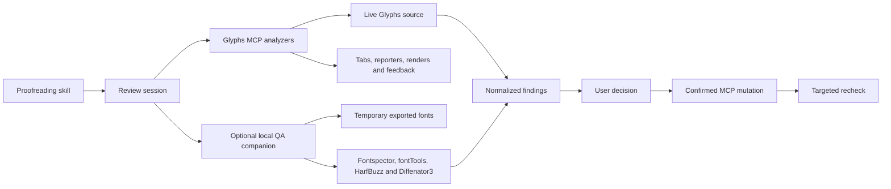

This plan defines an end-to-end font-proofreading capability for Glyphs MCP.
Its requirements come from the state and failure modes of font sources,
interpolation, OpenType shaping, and exported binaries.

The planned product is a guided review session, not a specimen or document
generator. Chat leads the process; Glyphs Edit tabs, reporters, annotations,
rendered images, and the feedback panel provide evidence.

## Product contract

The first release is:

- Latin-first with script-neutral finding and session schemas
- usable with native Glyphs MCP tools when no external software is installed
- resumable across AI conversations and Glyphs restarts
- read-only until a user approves an explicit proposal or dry run
- based on evidence states rather than a quality score
- compatible with Glyphs 3.5 and Glyphs 4

Out of scope:

- PDF, HTML, or print-layout generation
- automatic saving or system-font installation
- autonomous aesthetic decisions
- inferred language or character-set promises
- bundling large QA runtimes into the Glyphs process
- multiscript expertise in the first release

## Architecture

### Responsibility boundaries

| Component | Responsibility |
| --- | --- |
| Proofreading skill | Stage order, explanations, tool selection, evidence synthesis, and approval pauses. |
| Glyphs MCP plug-in | Live source snapshots, native analysis, Glyphs navigation, rendering, feedback UI, and guarded mutation. |
| Session store | Resumable stage state, findings, decisions, versions, fingerprints, and verification history. |
| QA companion | Isolated temporary builds and heavyweight binary, shaping, and regression analysis. |
| Designer | Intended coverage, design intent, risk acceptance, mutation approval, and saving. |

The plug-in should expose one coherent tool surface. External-facing tools may
proxy to the optional local companion, but callers should receive the same
structured capability and error responses whether the worker is installed or
not.

## Session and finding contracts

A review session contains:

- stable session ID and `latin_full` profile version
- font identity and in-memory source fingerprint
- intended languages, glyph-set target, instances, and optional reference build
- Glyphs, plug-in, skill, and analyzer versions
- ordered stages with dependency and status data
- normalized findings and evidence references
- user decisions and verification history
- temporary artifact references and cleanup state

Persist sessions under Glyphs MCP application-support storage. Do not add
custom data to the font. A changed source fingerprint makes dependent findings
`stale`; it must not silently erase them or leave them marked verified.

Stage states:

- `pending`
- `running`
- `passed`
- `needs_review`
- `unavailable`
- `skipped`
- `stale`

A finding contains:

- ID, rule ID, stage, severity, and evidence class
- target font/master/instance/glyph/layer/pair/feature/axis/build
- concise message and bounded structured measurements
- analyzer name and version
- navigation, render, or external-output evidence references
- proposed actions and whether a dedicated safe tool supports them
- state and decision rationale

Finding states are `open`, `proposed`, `fixed`, `verified`, `accepted_risk`, and
`dismissed`. Evidence classes are `deterministic`, `statistical`, and `visual`.
Severities are `blocker`, `error`, `warning`, and `note`. Do not compute an
aggregate score.

## Public MCP interfaces

### Session tools

| Tool | Purpose |
| --- | --- |
| `start_font_review` | Create or resume a review after resolving the font, profile, coverage, languages, instances, and optional reference build. |
| `get_font_review` | Return bounded progress or findings filtered by stage, state, severity, or target. |
| `run_font_review_stage` | Run the analyzers assigned to one stage and normalize results. |
| `show_font_review_finding` | Open the best Glyphs target, tab, reporter, render, annotation, or feedback item. |
| `set_font_review_finding_state` | Record proposals and user decisions; require rationale for accepted risk, dismissal, and skipped required stages. |
| `verify_font_review` | Recompute the source fingerprint, invalidate dependent evidence, and rerun selected findings or stages. |
| `complete_font_review` | Validate explicit outcomes and return a structured checklist without generating a document. |

All session tools except confirmed mutation dispatch are read-only with respect
to the font. Register them in the `Read-only` profile where possible.

### New native analyzers

| Tool | Minimum responsibility |
| --- | --- |
| `review_font_structure` | Masters, axes, instances, naming, metrics, custom parameters, identifiers, and export configuration. |
| `review_glyph_integrity` | Names, Unicode, export state, required layers, contours, components, and bounded construction inconsistencies. |
| `review_anchor_consistency` | Missing, unexpected, or inconsistent anchors across relevant glyphs and masters. |
| `review_interpolation_compatibility` | Contour topology, node order and type, components, anchors, and sampled locations. |
| `review_feature_health` | Compilation, missing references, generated/manual state, and declared feature coverage. |
| `review_changed_glyphs` | Glyphs changed since a session snapshot or explicit source/build reference. |
| `open_font_review_tab` | Open named, bounded review corpora for selected masters, instances, styles, or feature states. |

Reuse current tools for context, Unicode review, curve analysis, spacing,
kerning, OpenType inspection, rendered images, annotations, feedback, and safe
apply operations. Do not reimplement those algorithms in the session layer.

### Companion-backed tools

| Tool | Purpose |
| --- | --- |
| `get_font_qa_capabilities` | Report worker health, engine versions, profiles, and supported artifact formats. |
| `export_font_review_build` | Export explicit instances or a variable font to an isolated temporary location without saving or installing. |
| `run_binary_qa` | Run bounded Fontspector checks and normalize their statuses. |
| `inspect_font_review_binary` | Inspect requested tables, coverage, metadata, instances, and variation structures with fontTools. |
| `shape_font_review_cases` | Shape structured text cases with HarfBuzz features, languages, directions, and variation coordinates. |
| `compare_font_review_builds` | Compare an explicit reference and current build with Diffenator3. |

The companion protocol must be versioned, local-only, structured, and bounded.
It must report exact engine versions, use isolated temporary directories, apply
timeouts and output caps, and never install fonts or modify sources.

## `latin_full` stage graph

1. **Intake**: resolve source, intent, coverage, instances, feature promises,
   reference build, and available capabilities.
2. **Family structure**: analyze masters, axes, metrics, names, instances,
   custom parameters, and export state.
3. **Glyph construction**: analyze coverage, Unicode, layers, paths,
   components, anchors, and construction consistency.
4. **Interpolation**: check compatibility and sample default, extremes, named
   instances, and intermediate locations.
5. **Spacing**: review representative controls, related glyphs, metrics
   outliers, tracking behavior, and cross-master consistency.
6. **Kerning**: review groups, effective pairs, collisions, gaps, exceptions,
   and master consistency.
7. **OpenType and shaping**: compile promised features and shape representative
   cases across relevant settings.
8. **Visual review**: conduct focused text, character-group, style, instance,
   and changed-glyph passes in Glyphs.
9. **Binary QA**: inspect temporary static and variable builds; compare a
   reference build when supplied.
10. **Triage and verification**: group root causes, propose bounded changes,
    confirm mutations, invalidate dependencies, and rerun affected checks.

Coverage completeness is assessed only when the user selects intended
languages or a glyph-set preset. Without that declaration, existing glyphs are
reviewed but missing-character checks are `skipped` with a reason.

## Delivery milestones

### 1. Contract and coverage map

- Freeze the session, stage, finding, evidence, and capability schemas.
- Map existing MCP tools to the stage graph.
- Define source fingerprint and dependency invalidation rules.
- Define the first Latin coverage and visual-review corpora.

Exit: fixtures can validate session transitions and normalized findings before
new Glyphs analyzers exist.

### 2. Native session MVP

- Implement local persistence and session tools.
- Add the `glyphs-mcp-proofread` skill.
- Aggregate session status in the existing feedback UI.
- Add navigation and named review-tab orchestration.
- Connect existing read-only tools without changing their contracts.

Exit: a native-only review can start, pause, resume, navigate findings, and
finish with an explicit checklist.

### 3. Native analysis gaps

- Implement structure, glyph integrity, anchor, interpolation, feature, and
  changed-glyph analyzers.
- Normalize all analyzer output through pure, Glyphs-independent helpers.
- Add bounded Latin corpora organized by review purpose.

Exit: the full source and visual stage graph works without the companion.

### 4. Companion QA

- Implement capability discovery and the local versioned protocol.
- Add isolated native exports.
- Integrate Fontspector, fontTools, and HarfBuzz.
- Add Diffenator3 only when an explicit reference build is supplied.

Exit: external results use the same finding model, remain optional, and fail
without breaking native review.

### 5. Confirmed changes and verification

- Link findings to existing dry-run and confirm-gated mutation tools.
- Display complete proposed target/value batches before approval.
- Invalidate and rerun affected evidence after mutation.
- Harden interruption, cleanup, source switching, and session recovery.

Exit: an approved correction can be applied, read back, and verified without
automatic saving or unrelated changes.

### 6. Later profiles

- script-specific review profiles and corpora
- release-channel profiles, including optional Google Fonts checks
- historical and continuous binary regression
- headless CI verification
- team handoff and issue-tracker adapters

## Test strategy

### Pure tests

- session state transitions and resume behavior
- deterministic source fingerprints and stale-result propagation
- finding normalization and bounded serialization
- dependency invalidation after each mutation class
- capability negotiation and companion error mapping
- corpus selection and output limits

### Glyphs integration tests

Exercise known-good and deliberately defective static, multi-master, and
variable fixtures in Glyphs 3.5 and Glyphs 4. Include:

- missing Unicode assignments and required layers
- invalid contours, component references, and anchor sets
- incompatible masters and intermediate interpolation failures
- spacing outliers and kerning collisions, gaps, and exceptions
- feature compilation and shaping failures
- unsaved fonts, multiple open documents, and source changes during a session
- navigation to the exact glyph, layer, pair, feature, instance, or axis

### Companion tests

- worker absent, incompatible, timed out, interrupted, or returning malformed data
- failed and partial exports
- analyzer warnings, failures, and bounded large result sets
- optional reference absent, valid, or incompatible
- cleanup after success, cancellation, crash, and Glyphs restart

### Safety and acceptance gates

V1 is accepted when:

- a user can complete and resume the full Latin workflow from chat
- every actionable finding has reproducible evidence and a Glyphs navigation target
- objective, statistical, and visual conclusions remain distinct
- native review works without the companion
- no font mutation occurs without an explicit reviewed proposal and confirmation
- no workflow automatically saves the source or installs an exported font
- approved changes trigger targeted verification
- completion returns an auditable checklist rather than a score or document
- schemas and required behavior match in Glyphs 3.5 and Glyphs 4

## Related documentation

- [AI-assisted font proofreading](../workflows/ai-font-proofreading.mdx)
- [Safety model](../concepts/safety-model.mdx)
- [Agent skills](../concepts/agent-skills.mdx)
- [Command set](../reference/command-set.mdx)
