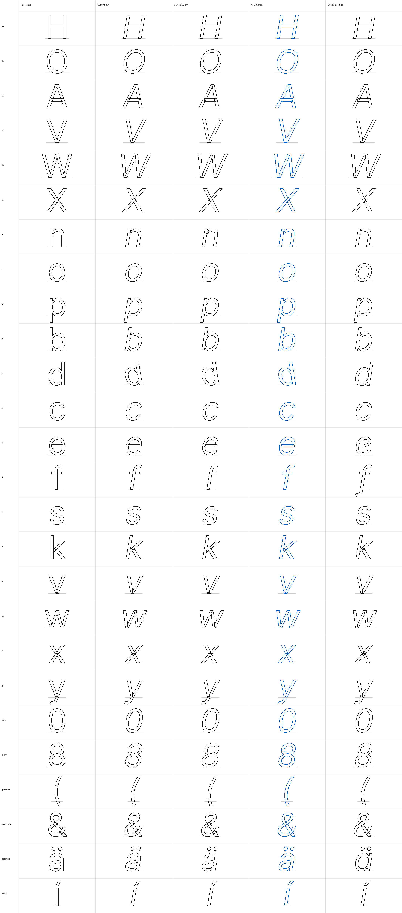

# Balanced italicification benchmark: Inter v4.1

## Result

The clean-room Balanced prototype passed the planned geometry acceptance checks
on the fixed 26-glyph Inter set:

- Topology preserved: 26/26 glyphs.
- Conservatively compensated straight-stem pairs: 6.
- Mean perpendicular stem-width error:
  - Raw: 0.9299 units.
  - Cursivy fallback: 0.6044 units.
  - Balanced: below 0.00000000000003 units.
- Balanced improvement: greater than 99.99% against both generated baselines
  for the compensated pairs.
- Maximum anchor-position error: 0 units.



The official Inter Italic is a qualitative reference only. Its `f`, `a`,
terminals, joins, proportions, and spacing show deliberate design changes that
no mechanical italicification pass should claim to reproduce.

## Reproduction

Run:

```sh
/usr/local/bin/python3.12 scripts/benchmark_italic_inter.py
```

The script expects the pinned [Inter v4.1 source](https://github.com/rsms/inter/tree/v4.1)
at `.cache/italic-benchmark/inter-e3a3d4c57d5ecc01453a575621882a384c1995a3`.
It selects exact `opsz=14`, `wght=400` masters:

- Roman `Regular`: `C698F293-3EC0-4A5A-A3A0-0FDB1F5CF265`.
- Official `Italic`: `11F4534A-B963-4AB5-820F-DAF9A20CD933`.
- Official Glyphs italic angle: `+9.4°`.

The benchmark glyphs are:

`H O A V W X n o p b d c e f s k v w x y zero eight parenleft ampersand adieresis iacute`

Generated JSON and PNG evidence is written beneath the ignored
`.cache/italic-benchmark/results` directory. No Inter source or font binary is
committed. Inter is licensed under the
[SIL Open Font License 1.1](https://github.com/rsms/inter/blob/v4.1/LICENSE.txt).

## Legacy baseline finding

Before source edits, the live Glyphs 4 MCP server successfully reviewed all 26
glyphs but failed every confirmed legacy application with
`component_detach_failed`. The old adapter attempted to replace Glyphs'
read-only components proxy. This failure is retained in the benchmark JSON as
the true current-tool baseline.

For a useful visual comparison, the script reproduces the intended Raw affine
geometry and the documented Cursivy concept through the new deterministic
fallback. The implemented adapter now uses the documented layer `shapes`
collection, so detached candidates work on Glyphs 4 without invoking private
Objective-C filter selectors.

## Clean-room provenance

The implementation was designed independently from affine-shear mathematics,
Glyphs' bundled Transformations documentation, and public descriptions of
curve/stem correction concepts in the
[Italify Python API documentation](https://www.sebastiancarewe.com/italify/python-api).

No Italify source, executable, package, private API, data model, identifiers,
or implementation details were inspected, decompiled, invoked, or copied.
The detector, interpolation model, constraints, diagnostics, names, tests, and
thresholds in this repository are original to this implementation.
