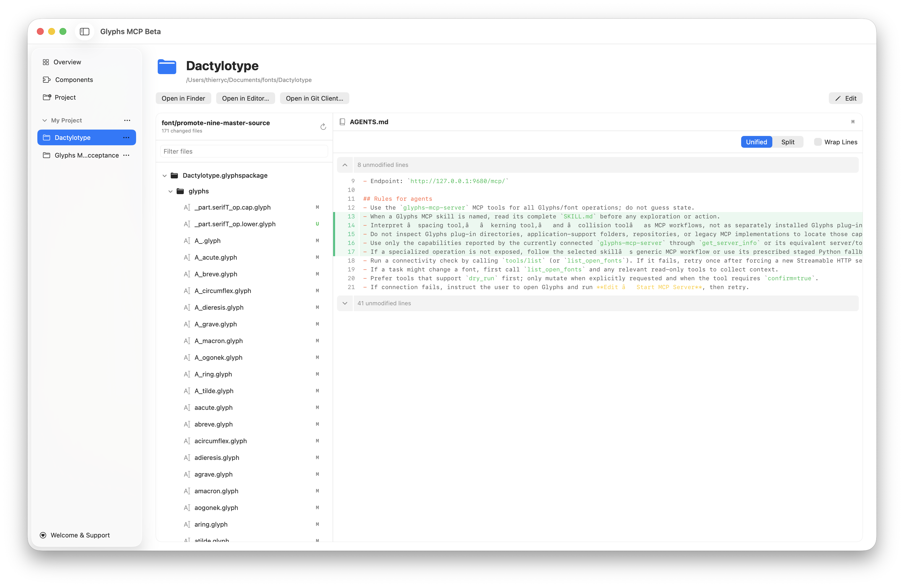

**Glyphs MCP.app** brings installation, server controls and font projects into one native macOS application. The 2.0.0 desktop candidate is distributed directly, outside the Mac App Store. Public publication is a separate release step.

## Overview and the menu bar

Overview shows the MCP service, its Glyphs connection and current work. The menu-bar icon opens the same information in a compact popover. It uses the Regular-S `litsquare.logo.glyphsMCP` artwork from LitSquare Symbols in a native square button, centered when idle. A steady cyan (`#00BBD0`) dot beside the logo indicates an active font task or sidecar-owned worker. A running but idle server has no dot; connection failures clear the dot until activity can be confirmed again. The button keeps the same width in both states, so neighboring icons do not move. The dot uses standard sRGB without a brightness boost. The saturated cyan improves light-menu visibility with a plain circle in both appearances.

Preparation shows a phase and elapsed time. Application and recovery show available progress in **changes**, which may differ from the number of layers. “Worker available” means `glyphs-cli` is installed; “worker running” means the sidecar owns a current worker process. A slow reply does not imply a modal dialog or a failed font operation.

The main view shows active work, proposals awaiting review, or one recent result. Older jobs are available under **Recent Tasks**. Results identify the operation and distinguish changes reverted in Glyphs from a proposal discarded before application.

One monitor serves Overview and the menu bar. Visible content refreshes every two seconds during work and every five seconds while idle. With both content views hidden, native job-file notifications wake the authenticated status reader; two-second checks continue only while the menu-bar dot indicates work. Hidden, idle views use no recurring checks. A failed connection preserves the last observation with a stale indication.

Start, Stop and port changes use the same control helper as Glyphs. Stop and component replacement refuse active preparation, application, cancellation or recovery. Prepared results and job identities are retained at the managed job store across controlled service restarts. An uncertain native result must be reconciled through its existing job ID; it is never automatically submitted again.

## Closing, quitting and login

- Closing the dashboard keeps the menu-bar interface available.
- **Quit Glyphs MCP** closes the desktop interface. The separate sidecar service keeps its own startup setting.
- **Settings → Open Glyphs MCP at login** is off initially. When enabled, login opens the menu-bar interface without opening the dashboard.
- **Start the MCP server at login** is a separate setting. An upgrade preserves its existing value.
- Menu-bar visibility defaults on and can be changed in Settings.

## Components and updates

Components retains the **Choose → Install → Ready** flow. Each component has a card with an image area, a description and documentation. A fresh installation selects Glyphs MCP, Curve Inspector and Reference Inspector. Existing installations restore their choices from the receipt, including an installation with all components removed.

When Glyphs is running, the orange **Quit Glyphs** button appears beside the Choose → Install → Ready steps. It uses Glyphs’ normal save prompt.

Checked cards install the bundled version of a component. “Install bundled version” does not indicate that a newer version has been found. Unchecking an installed card marks it **Remove**; unchecking an absent component does nothing. Choose **Apply Changes** to apply the selection. Rechecking a card cancels its pending removal. The separate removal list is no longer needed.

Overview shows the same component cards with **Install** and **Remove** buttons. Both open Components with the proposed selection. Choose **Apply Changes** after reviewing it and closing Glyphs. Remove uninstalls the component while keeping its preferences; hiding an inspector overlay remains a separate action in Glyphs’ View menu.

### Curve Inspector

Inspect curve geometry and handles directly on the canvas. After installation, enable **View → Curve Inspector** in Glyphs. See [visual review](../workflows/visual-review.mdx) for the companion workflow.

### Reference Inspector

Compare outlines and spacing against Last Saved, another font file, Local Git or Public GitHub. Choose the reference under **Edit → Comparison Reference**, then enable its overlay in the View menu. See [visual review](../workflows/visual-review.mdx) for the reference workflow.

**Check for Updates…** uses Sparkle and the project's GitHub update feed. Automatic checking is opt-in; installation remains your choice. Updating the desktop app and migrating installed Glyphs components are separate steps. If component migration fails, the manager remains available to work with the previous installation or retry.

## Projects

The **Project** sidebar destination, directly below Components, opens the template gallery. The collapsible **My Project** section lists recent folders and restores the last selected project on launch. Its heading is a label; the disclosure arrow expands or collapses the list. Use its **More** menu to open a folder or create a project. The gallery includes the bundled starter, public catalog templates, and your local editable templates.

Selecting a project opens its workspace with Finder, editor, and Git-client
shortcuts plus a read-only Git diff browser. The resizable left pane groups
changed files into folders and supports filtering; the right pane loads only
the selected file. Source diffs offer unified or split layouts and optional
line wrapping. Individual files under `.glyphspackage/glyphs/` also offer a
Visual/Text switch, layer and overlay controls, and guides. In Both mode,
unchanged geometry remains neutral while only the symmetric delta, changed
reference segments, anchors and width band receive comparison color. Current
geometry remains near-black, reference changes are mint and the delta fill is
cyan. Nodes and handles use lighter neutral grays. Use the arrow
buttons to visit each localized difference and Reset to return to full-glyph
Fit. The canvas supports Command-plus/minus/zero, Command-Option-zero actual
size, trackpad pinch, Option-scroll and the temporary Z click-zoom tool. Hold
Space for a pure-black filled silhouette without changing the viewport.
Binary, invalid UTF-8, symlink and over-2-MiB sides show a clear unavailable
state. The browser cannot edit, comment, stage or commit.

Each project row has a **…** menu for Finder, settings, and removal from the
list. **Edit** opens the same settings from the workspace: change its display
name or reconnect a moved folder. These actions preserve project files.

## Support and diagnostics

**Welcome & Support** opens the reusable welcome window manually. This does not change the bridge's existing first-launch welcome preference or its heart button.

Overview's **Troubleshooting** section contains versions, paths and **Copy Diagnostic Report**. Authentication values are removed from the copied report. A stale status is a last observation, not confirmation that execution stopped.

See [installation](installation.mdx), [projects and templates](../workflows/projects.mdx), and [troubleshooting](troubleshooting.mdx).

Port changes are available when the current font task finishes; they are not queued. After applying a new MCP port, update your AI connections to use it.
