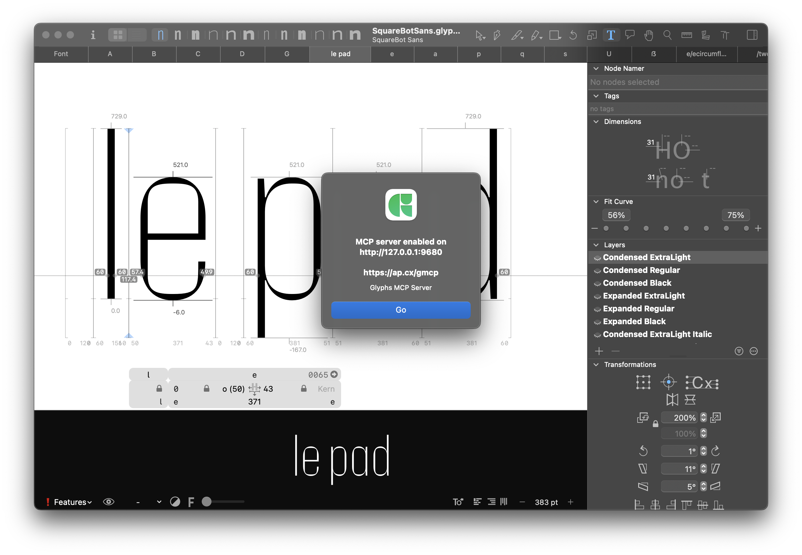

Glyphs MCP is a **Model Context Protocol (MCP)** server for [Glyphs](https://glyphsapp.com) that exposes font-specific tools to AI and LLM agents.

It’s built to be **tools-first** (deterministic, scriptable capabilities) and **safe by default** (confirm-gated mutations and no auto-save).

## Who this is for

- **Type designers** who want a practical assistant for spacing/kerning workflows in Glyphs.
- **Font engineers / tool builders** who want an inspectable tool surface for automation and experimentation.

## Start here

- [First session (10 minutes)](./tutorial/first-session.mdx)
- [How Glyphs MCP works](./concepts/how-glyphs-mcp-works.mdx)
- [Safety model](./concepts/safety-model.mdx)

## Quickstart

1. Install: `python3 install.py`  
2. In Glyphs: **Edit → Start Glyphs MCP Server**  
3. Connect: `http://127.0.0.1:9680/mcp/`

Next steps:
- [Installation](./getting-started/installation.mdx)
- [Start the server](./getting-started/start-server.mdx)
- [Connect a client](./getting-started/connect-client.mdx)
- [Troubleshooting](./getting-started/troubleshooting.mdx)

## What you can do

- Inspect open fonts, glyphs, masters, components, kerning, and selection state.
- Generate kerning worklists and proof tabs, then audit outliers.
- Review spacing suggestions, dry-run, and apply changes conservatively.
- Search bundled Glyphs docs on demand via `docs_search` / `docs_get`.

Guides:
- [Kerning workflow](./kerning-workflow.md)
- [Kerning tools](./kerning-tools.md)
- [Spacing tools](./spacing-tools.md)

## Reference

- [Command set](./reference/command-set.mdx)
- [Resources](./reference/resources.mdx)
