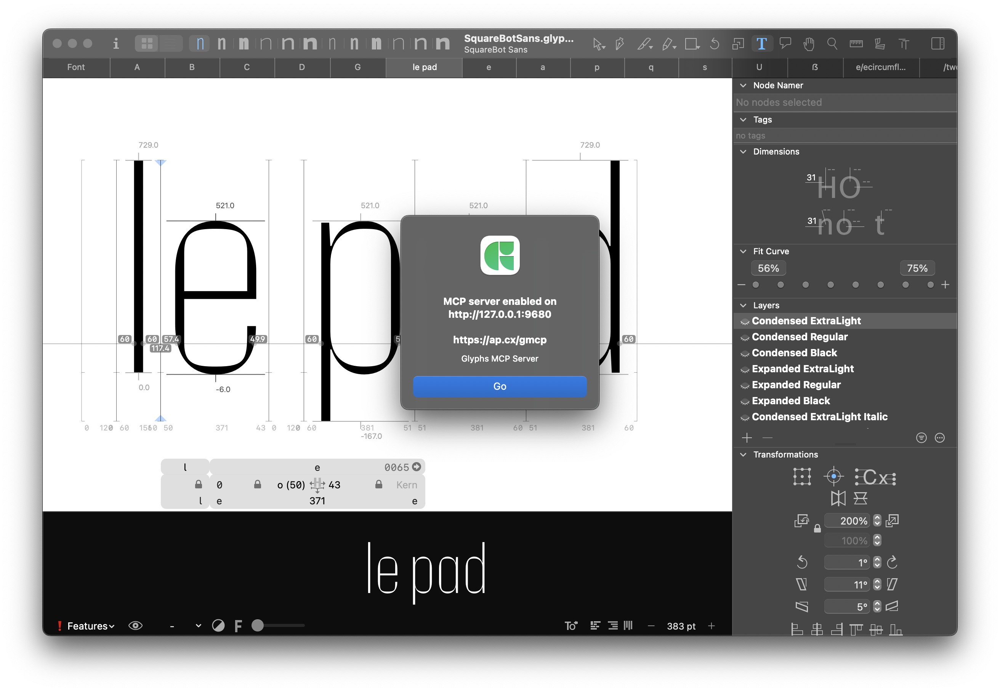

Glyphs MCP is a **Model Context Protocol** server for [Glyphs 4 beta](https://glyphsapp.com). It runs as a Glyphs plug-in, exposes a local Streamable HTTP endpoint, and lets AI clients call font-specific tools against the fonts you already have open.

Current public docs URL:

```text
https://thierryc.github.io/Glyphs-mcp/
```

## What Glyphs MCP is

Glyphs MCP gives an agent a structured way to inspect and operate Glyphs:

- The **Glyphs app** stays the source of truth for your fonts, masters, glyphs, layers, kerning, spacing, and selection.
- The **Glyphs MCP plug-in** runs inside Glyphs and bridges GlyphsApp APIs to MCP tools.
- The **local MCP server** exposes those tools at `http://127.0.0.1:9680/mcp/`.
- Your **AI client** calls tools such as `list_open_fonts`, `review_spacing`, `generate_kerning_tab`, or `docs_search`.

The design is tools-first: use deterministic, named tools before falling back to free-form code. Mutating workflows are built around read-before-write, dry-run or confirm-gated mutations, and no auto-save.

## Who it is for

- **Type designers** who want practical assistance for spacing, kerning, proofing, and review workflows in Glyphs.
- **Font engineers** who want inspectable automation around Glyphs files, UFO/designspace export, OpenType feature checks, and repeatable diagnostics.
- **Tool builders** who want a local, scriptable bridge between Glyphs and modern AI clients without brittle UI automation.

## Quick links

- [Installation](./getting-started/installation.mdx)
- [First session](./tutorial/first-session.mdx)
- [Start the server](./getting-started/start-server.mdx)
- [Connect a client](./getting-started/connect-client.mdx)
- [Use skills](./getting-started/use-agent-skills.mdx)
- [Safety model](./concepts/safety-model.mdx)
- [Command set](./reference/command-set.mdx)

## Quickstart

1. Install the plug-in and dependencies:

   ```bash
   python3 install.py
   ```

2. In Glyphs, start the local server:

   ```text
   Edit -> Glyphs MCP Server
   ```

3. Connect your MCP client to:

   ```text
   http://127.0.0.1:9680/mcp/
   ```

4. Verify with a read-only tool call:

   ```text
   Call list_open_fonts and tell me how many fonts are open.
   If you see an error, quote it verbatim.
   ```

## What you can do

- Inspect open fonts, masters, glyphs, components, paths, kerning, selection state, and selected nodes.
- Generate kerning worklists, audit collisions or near-misses, and apply approved bumper fixes safely.
- Review spacing suggestions, run dry runs, apply conservative sidebearing changes, and visualize the spacing model.
- Inspect OpenType stylistic sets and feature-linked glyph groups.
- Review stem prerequisites and apply guarded first-pass italic or oblique transforms.
- Preview and apply compensated tuning transforms across compatible masters.
- Export UFO masters and designspace documents with structured logs.
- Search bundled Glyphs docs on demand with `docs_search` and `docs_get`.

For deeper workflow guidance, start with [How Glyphs MCP works](./concepts/how-glyphs-mcp-works.mdx) and [Safety model](./concepts/safety-model.mdx).
