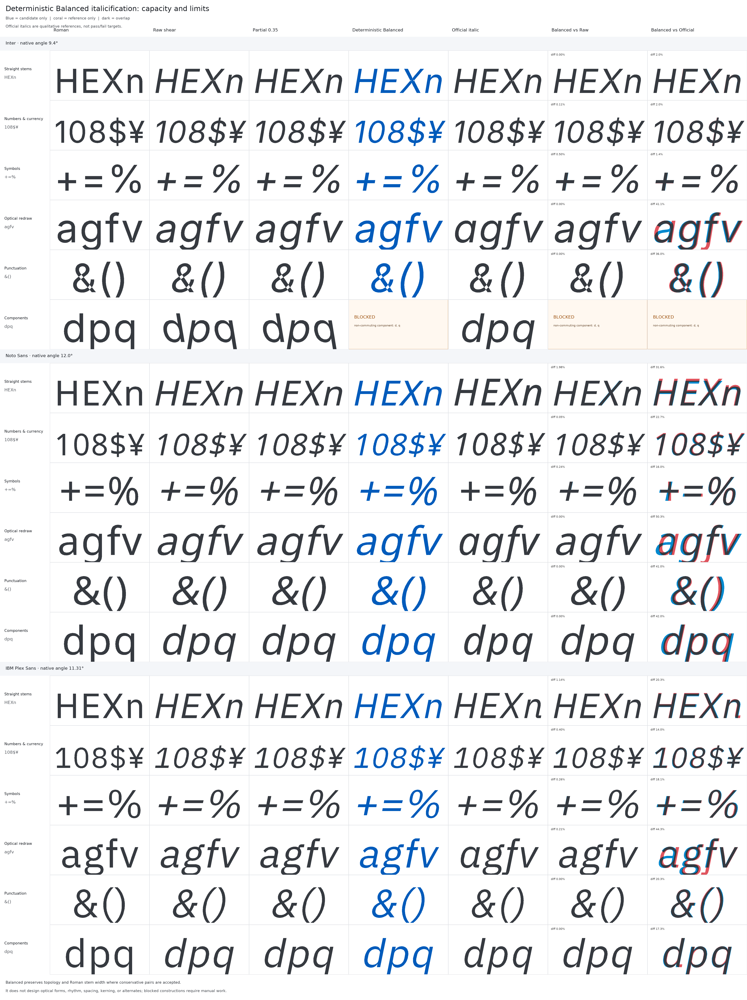

# Italic first pass

:::caution Experimental

Glyphs MCP can generate guarded Raw, Cursivy, and Balanced first-pass layers
from a Roman master. The result is a construction draft for the designer, not
a finished or authentic italic design.

:::

## Design goal

An italic commonly works as a companion to the Roman, providing contrast and
emphasis inside text. The Glyphs MCP workflow has the narrower goal of helping
the designer begin that companion efficiently: it establishes a controlled
slant, preserves reusable structure, and reports geometry that needs review.

It does not decide the italic's voice. Character construction, optical
correction, rhythm, spacing, kerning, alternates, interpolation, and proofing
remain design work. In particular, mechanically transformed `a`, `e`, `f`,
`g`, `k`, `v`, `w`, `x`, `y`, punctuation, brackets, quotes, and symbols
usually need deliberate redrawing.

## Modes

- `raw` applies a deterministic affine shear around the selected origin.
- `cursivy` uses Glyphs' callable Transformations filter when available. On
  hosts where that public Python entry point is unavailable, it reports and
  uses a conservative pure-Python straight-stem fallback.
- `balanced` is a reproducible pure-Python pipeline. It builds Raw, applies the
  conservative straight-stem correction at partial strength, interpolates
  between those compatible coordinates, and then applies the requested final
  compensation to confidently detected vertical or diagonal stem pairs. It
  never invokes the Glyphs Transformations filter.

Balanced is the recommended experimental deterministic option. Calls that omit
`slant_mode` continue to use Cursivy for backward compatibility.

Balanced defaults to `curve_strength=0.75` and
`stem_compensation=1.0`. Both accept values from `0` through `1`.
`curve_strength=0` is exactly Raw before final compensation, while
`curve_strength=1` uses the complete deterministic partial-correction
candidate. The controls are independent. At `stem_compensation=1`, accepted
stems converge to their Roman perpendicular width, so the final correction can
make the intermediate `curve_strength` difference visually subtle.

## Symbols that may stay upright

Unicode identity can identify glyphs that deserve review, but it cannot decide
their italic treatment. The workflow therefore reports the tiers below as
advisories. It does not silently exclude glyphs, change `protected_glyphs`,
preserve Roman outlines, or apply a zero-angle workaround.

The evidence sample used the 20 highest-ranked families with Regular and Italic
styles in the [Google Fonts family metadata](https://fonts.google.com/metadata/fonts)
on July 30, 2026: Roboto, Open Sans, Google Sans, Inter, Montserrat, Poppins,
Lato, Roboto Condensed, Arimo, Roboto Mono, Noto Sans, DM Sans, Raleway,
Nunito, Nunito Sans, Playfair Display, Rubik, Ubuntu, Kanit, and Merriweather.
We compared the filled-outline slant of each Roman and Italic glyph with
[fontTools `StatisticsPen`](https://fonttools.readthedocs.io/en/latest/pens/statisticsPen.html),
treated an absolute slant delta below `0.035` as upright, and visually reviewed
the results.

| Review tier | Unicode values | Evidence and recommended handling |
| --- | --- | --- |
| Empirical upright candidates | `U+00A4 ¤`, `U+00A9 ©`, `U+00AE ®`, `U+00B0 °`, `U+212E ℮` | `¤`, `©`, `®`, and `°` stayed upright in 12/20 families; `℮` did so in 11/18. Compare with the Roman before deciding. |
| Empirical candidates with limited coverage | `U+2190 ←`, `U+2191 ↑`, `U+2192 →`, `U+2193 ↓`, `U+25A0 ■` | Each stayed upright in 7/8 supporting families. Treat the result as strong but smaller-sample evidence. |
| Traditionally upright math operators | `U+002B +`, `U+003C–U+003E <=>`, `U+00AC ¬`, `U+00B1 ±`, `U+00D7 ×`, `U+00F7 ÷`, `U+220F ∏`, `U+2211 ∑`, `U+2212 −`, `U+221A √`, `U+221E ∞`, `U+222B ∫`, `U+2248 ≈`, `U+2260 ≠`, `U+2264–U+2265 ≤≥` | [Microsoft's character-design guidance](https://learn.microsoft.com/en-us/typography/develop/character-design-standards/math) describes math signs as traditionally upright, but popular text-font italics often slant them. Only 4/20 reviewed families kept `+` upright. Decide from the family's purpose and math support. |
| Design-dependent forms | `U+0023 #`, `U+002A *`, `U+0040 @`, `U+007C \|`, `U+007E ~`, `U+2022 •`, `U+2122 ™` | Inspect each design. Only 7/20 reviewed families kept `@` statistically upright, and some kept its enclosure upright while italicizing the internal letter. |

### Sources and interpretation

- [Microsoft's Latin-1 math character-design standards](https://learn.microsoft.com/en-us/typography/develop/character-design-standards/math)
  state the traditional upright convention and give design, alignment, width,
  and spacing guidance for `+`, `−`, `=`, `≠`, `<`, `>`, `≤`, `≥`, `±`, `×`,
  `~`, `¬`, and `≈`. This is design guidance, not a requirement that every
  text italic preserve every operator unchanged.
- The [Microsoft OpenType `MATH` table specification](https://learn.microsoft.com/en-us/typography/opentype/spec/math)
  distinguishes slanted characters from straight operators or delimiters when
  explaining italic correction. That model supports separate treatment, but
  it describes mathematical layout rather than general-purpose text italics.
- [Unicode Technical Report #25, *Unicode Support for Mathematics*](https://www.unicode.org/reports/tr25/)
  separates operators, identifiers, delimiters, arrows, and geometric shapes.
  It explicitly calls for an upright `U+220A ∊` and notes that integral slant
  varies by typographic tradition, so Unicode does not justify a blanket
  upright rule for every mathematical symbol.
- [Google Fonts family metadata](https://fonts.google.com/metadata/fonts)
  supplied the popularity order and available Regular/Italic styles for the
  dated corpus. The [Google Fonts static-font guidance](https://googlefonts.github.io/gf-guide/statics.html)
  documents its Italic style and negative exported `italicAngle` convention.
  Popularity and font binaries can change after the snapshot date.
- [fontTools `StatisticsPen`](https://fonttools.readthedocs.io/en/latest/pens/statisticsPen.html)
  supplied the area-based glyph slant measurement. Its documentation warns
  that self-intersecting outlines can affect statistics; visual review remains
  part of the method.

Before a mechanical pass, the agent resolves scoped glyphs through their
Unicode values and shows every match. The designer then chooses whether to
include it, explicitly exclude it from that pass, or defer it for manual
drawing. An upright symbol remains a separate drawing decision; the italic
master keeps its actual `italicAngle`.

## Broad-Latin evidence

The benchmark covers 543 encoded glyphs in both pinned Inter and Noto Sans
sources plus the 391 values shared by pinned IBM Plex Sans Regular and Italic
UFOs:

| Family | Topology | Compensated pairs | Raw error | Partial error | Balanced error | Component-risk glyphs |
| --- | ---: | ---: | ---: | ---: | ---: | ---: |
| Inter v4.1 | 543/543 | 135 | 2.7812 | 1.8078 | &lt;0.00000000000004 | 23 |
| Noto Sans | 543/543 | 102 | 1.2912 | 0.8393 | &lt;0.00000000000002 | 2 |
| IBM Plex Sans | 391/391 | 102 | 1.2607 | 0.8194 | &lt;0.00000000000002 | 0 |

Every generated mode preserved topology, review left all source layers
unchanged, anchor error was zero, and no unsafe compensation was applied.
Balanced exceeded the required 50% source-width improvement over both
deterministic alternatives in each family. Recursive component analysis found
23 Inter glyphs and 2 Noto Sans glyphs whose transforms do not commute with
the requested shear. Balanced blocked every one before application, so the
safety gates pass with zero unsafe component applications. In Inter, this
includes `d` and `q`, which are built from horizontally reflected components;
Plex draws those forms directly and does not show the reversal.

This is evidence for a safer mechanical first pass—not evidence that Balanced
resembles a designed italic. Mean Balanced-versus-official silhouette
differences were `7.237%` for Inter, `29.219%` for Noto Sans, and `19.798%`
for IBM Plex Sans because the official italics include deliberate redrawing,
recomposition, and spacing.

[Read the complete three-family report](contributor/italic-balanced-broad-latin-benchmark.md).
Click the combined story sheet for the full `4800 × 6424`, 144-DPI source.

The family-specific audit sheets remain available for closer inspection:

## Safety and diagnostics

`review_italic_first_pass` runs the complete transformation on detached layer
copies. It reports topology preservation, the effective backend and strengths,
origin pivot, anchor shifts, component placement, component-master conflicts,
candidate bounds and metrics, and detected/compensated/skipped stem pairs.

Balanced mode:

- Never changes path count, node order, node types, smooth flags, or curve
  handles during stem compensation.
- Moves only both endpoints of accepted straight sides.
- Preserves live components and adjusts only component x placement using
  `x += tan(angle) * y`.
- Shears copied anchors using
  `x′ = x + tan(angle) * (y - pivotY)`.
- Recursively inspects component chains and reports each matrix, determinant,
  shear commutator, and chain.
- Permits translation and commuting linear transforms, including uniform
  scale.
- Blocks reflection, rotation, non-uniform scale, cycles, unreadable
  transforms, and explicit component-master mismatches when safety cannot be
  established within `1e-6`.
- Applies a reviewed batch all-or-nothing. It never silently excludes glyphs;
  the designer can explicitly rerun with `skip_glyphs`.

Safety is based on actual outlines and component construction, not glyph names
or Unicode categories. Protected and design-sensitive forms still receive
manual-review warnings without being blocked merely because of their identity.

`stem_policy=copy_from_source` remains review-only. It reports source stem
availability but does not silently edit Font Info; use
`set_master_stem_metrics` for that separate confirmed mutation.

## Recommended workflow

1. Verify the source Roman and target italic masters and the target
   `italicAngle`.
2. For path-only or transform-safe constructions, compare Balanced with Raw
   and Cursivy; inspect blocked glyphs, components, anchors, topology, stems,
   bounds, and metrics.
3. Run `apply_italic_first_pass` with `dry_run=true`.
4. If the batch is blocked, decide whether to rebuild those components or
   explicitly rerun with `skip_glyphs`.
5. Apply only the approved scope with `confirm=true`.
6. Redraw, space, kern, and proof the result as an italic design.

The tool never saves the font.
