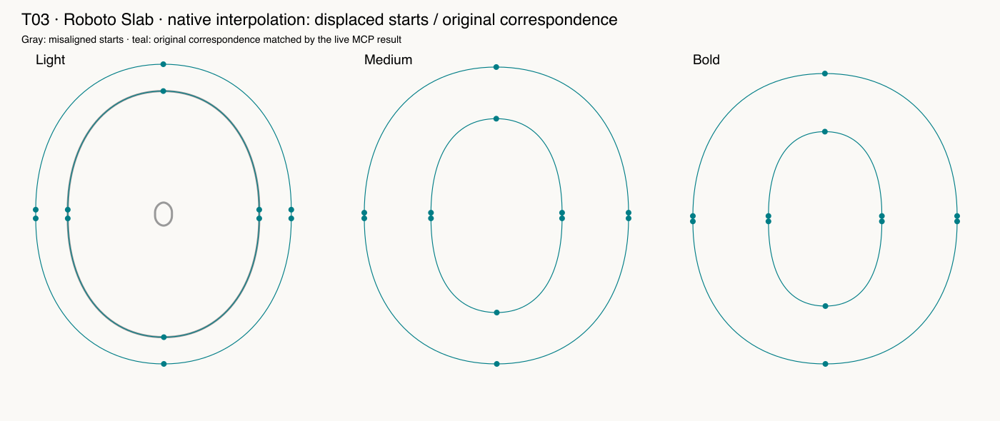

# T03 — Start-node correspondence and interpolation repair

Route: **Public seven-tool MCP**. Font: pinned open-source Roboto Slab, three native masters.

V2 proposes only two permutations. The live result matches the original contour phases and retains objects. Native Light interpolation of the deliberately shifted source has a collapsed outline; the verified original correspondence removes it. The defect was deliberately seeded, not found in upstream Roboto Slab.

Final checks: 8 passed, 0 failed, 0 blocked, 0 unverified. See [exact assertions](assertions-final.json); earlier raw facts retain their first-attempt results.

LLM judgment: correctness evidence 5/5; design usefulness 5/5; focused skill 4/5; workflow effort 4/5. This is self-assessment by the executing LLM.

Instrumented public requests: 7; median 42.06 ms, range 13.39–654.42 ms, p95 478.91 ms. Different phases are mixed here; see the [call log](../../calls.jsonl). These are HTTP times, not native edit execution.

Suggested action: The existing supported job is effective. Keep exact reference/master/path scope and a native interpolation proof.

Preservation applies to recorded native coordinates, objects, hint references, metadata, anchors, widths, transforms and flags as covered by the oracle; all immutable source file bytes were separately hashed. The real edited layers have no hints, so populated-hint preservation is **unverified**.

