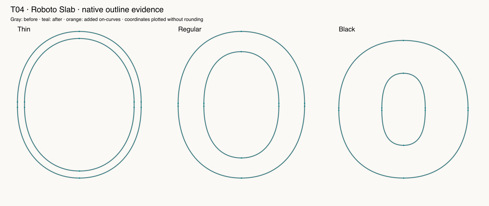

# T04 — Local handle modification

Route: **Authored native Glyphs 4 script; not an MCP editing capability**. Font: pinned open-source Roboto Slab, three native masters.

First request +2.5 rounded to +3. The corrected snippet moves precisely one off-curve per master and preserves node metadata, anchors, widths and grid settings. The visual change is under one unit and no aesthetic improvement is established.

Final checks: 7 passed, 0 failed, 0 blocked, 0 unverified. See [exact assertions](assertions-final.json); earlier raw facts retain their first-attempt results.

LLM judgment: correctness evidence 4/5; design usefulness 2/5; focused skill 3/5; workflow effort 3/5. This is self-assessment by the executing LLM.

Final isolated native action: **1.326 ms, n=1**. Excludes font load, script creation, validation, independent oracle and reporting. Not a full-session performance benchmark.

Suggested action: Add a tested fractional-coordinate recipe to focused scripting guidance.

Preservation applies to recorded native coordinates, objects, hint references, metadata, anchors, widths, transforms and flags as covered by the oracle; all immutable source file bytes were separately hashed. The real edited layers have no hints, so populated-hint preservation is **unverified**.

