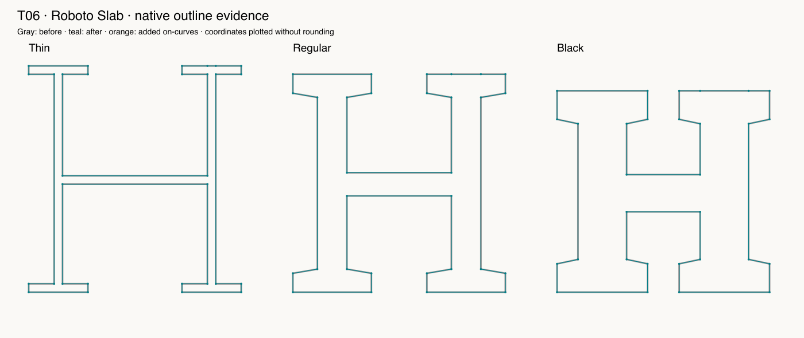

# T06 — Remove a redundant point

Route: **Authored native Glyphs 4 script; not an MCP editing capability**. Font: pinned open-source Roboto Slab, three native masters.

The original guard rejects the rounded setup rather than removing a non-midpoint. After precise fixture creation, only the three seeded redundant nodes disappear. A perturbed .125-unit negative control is rejected before any partial write. This is a deliberately narrow snippet, not a general curve simplifier.

Final checks: 8 passed, 0 failed, 0 blocked, 0 unverified. See [exact assertions](assertions-final.json); earlier raw facts retain their first-attempt results.

LLM judgment: correctness evidence 4/5; design usefulness 4/5; focused skill 3/5; workflow effort 3/5. This is self-assessment by the executing LLM.

Final isolated native action: **1.227 ms, n=1**. Excludes font load, script creation, validation, independent oracle and reporting. Not a full-session performance benchmark.

Suggested action: Retain prevalidation across all masters; never generalize this deletion rule to curved segments.

Preservation applies to recorded native coordinates, objects, hint references, metadata, anchors, widths, transforms and flags as covered by the oracle; all immutable source file bytes were separately hashed. The real edited layers have no hints, so populated-hint preservation is **unverified**.

