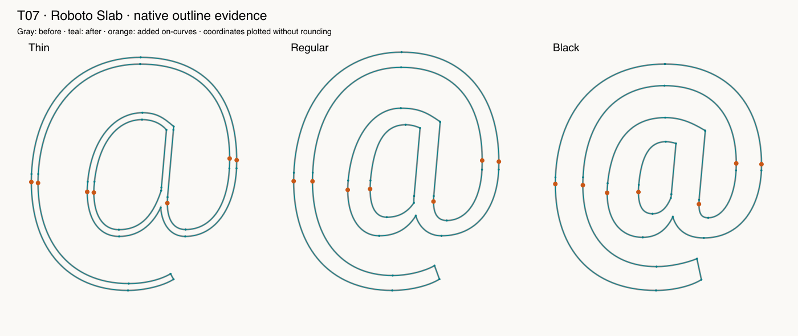

# T07 — Native extrema placement

Route: **Authored native Glyphs 4 script; not an MCP editing capability**. Font: pinned open-source Roboto Slab, three native masters.

Native addNodesAtExtremes adds seven on-curves and fourteen handles per master. The first call exceeds the .05-unit geometry tolerance. Rounding suppression preserves the native result with numerical control-polygon deviation bounds below 1.5e-12 across six contours. Native compatibility and collateral data are retained.

Final checks: 7 passed, 0 failed, 0 blocked, 0 unverified. See [exact assertions](assertions-final.json); earlier raw facts retain their first-attempt results.

LLM judgment: correctness evidence 4/5; design usefulness 4/5; focused skill 3/5; workflow effort 3/5. This is self-assessment by the executing LLM.

Final isolated native action: **5.973 ms, n=1**. Excludes font load, script creation, validation, independent oracle and reporting. Not a full-session performance benchmark.

Suggested action: Recommend native extrema with precision protection and reinspection; do not imply that independently added extrema always correspond well on other fonts.

Preservation applies to recorded native coordinates, objects, hint references, metadata, anchors, widths, transforms and flags as covered by the oracle; all immutable source file bytes were separately hashed. The real edited layers have no hints, so populated-hint preservation is **unverified**.

