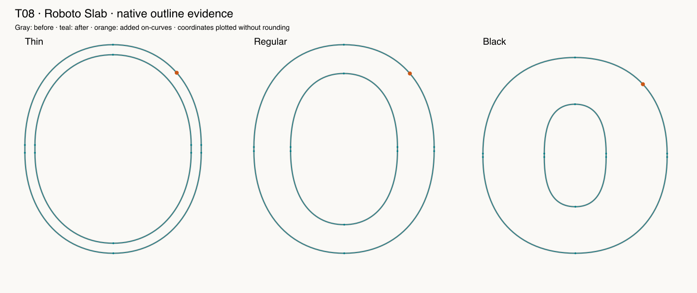

# T08 — Corresponding cubic split across masters

Route: **Authored native Glyphs 4 script; not an MCP editing capability**. Font: pinned open-source Roboto Slab, three native masters.

First split changed shape by .395–.451 units despite matching node counts and native compatibility. Corrected split preserves three master curves and native Light/Medium/Bold interpolations within 6e-13. The new on-curve is a homologous editing landmark, not demonstrated improvement to the already-correct design.

Final checks: 10 passed, 0 failed, 0 blocked, 0 unverified. See [exact assertions](assertions-final.json); earlier raw facts retain their first-attempt results.

LLM judgment: correctness evidence 4/5; design usefulness 3/5; focused skill 3/5; workflow effort 3/5. This is self-assessment by the executing LLM.

Final isolated native action: **2.694 ms, n=1**. Excludes font load, script creation, validation, independent oracle and reporting. Not a full-session performance benchmark.

Suggested action: Explain the distinction between geometric preservation, compatible indexing and better design; prefer explicit bounded native scripts to a new topology engine.

Preservation applies to recorded native coordinates, objects, hint references, metadata, anchors, widths, transforms and flags as covered by the oracle; all immutable source file bytes were separately hashed. The real edited layers have no hints, so populated-hint preservation is **unverified**.

