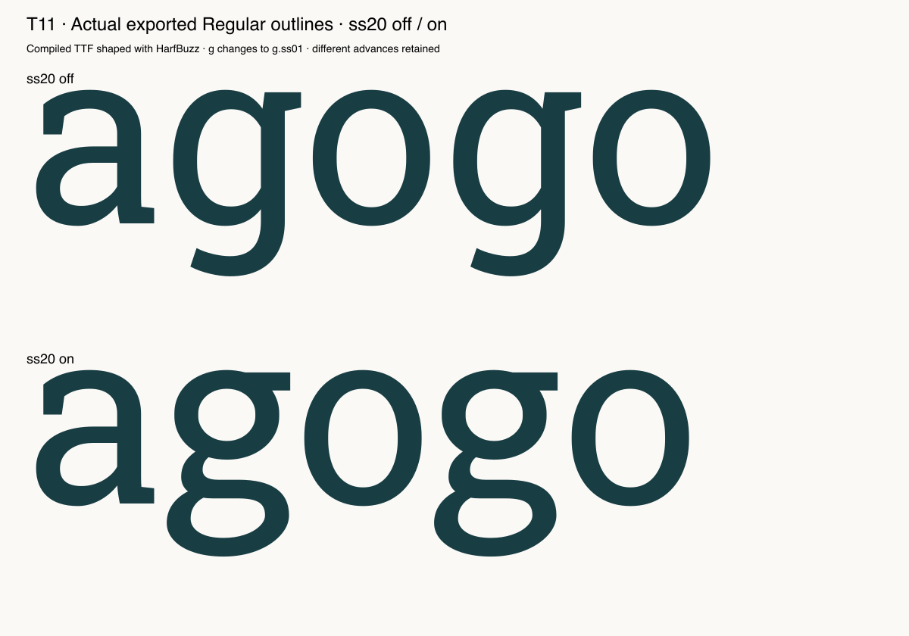

# T11 — Create and verify an OpenType feature

Route: **Authored native Glyphs 4 script; not an MCP editing capability**. Font: pinned open-source Roboto Slab, three native masters.

Native ss20 compiles and a real exported TTF substitutes g.ss01 only when enabled. Existing code and glyph data stay intact. The pinned export example fails with FontPath; fontPath works. ss20 intentionally duplicates existing ss01 as an isolated test, so it should not ship as a design improvement.

Final checks: 5 passed, 0 failed, 0 blocked, 0 unverified. See [exact assertions](assertions-final.json); earlier raw facts retain their first-attempt results.

LLM judgment: correctness evidence 4/5; design usefulness 2/5; focused skill 1/5; workflow effort 3/5. This is self-assessment by the executing LLM.

Final isolated native action: **55.425 ms, n=1**. Excludes font load, script creation, validation, independent oracle and reporting. Not a full-session performance benchmark.

Suggested action: Add verified Glyphs 4 argument names and require actual output/shaping evidence. Use the existing feature in production.

Preservation applies to recorded native coordinates, objects, hint references, metadata, anchors, widths, transforms and flags as covered by the oracle; all immutable source file bytes were separately hashed. The real edited layers have no hints, so populated-hint preservation is **unverified**.

